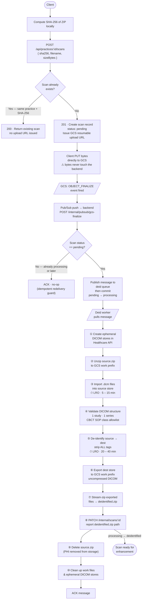
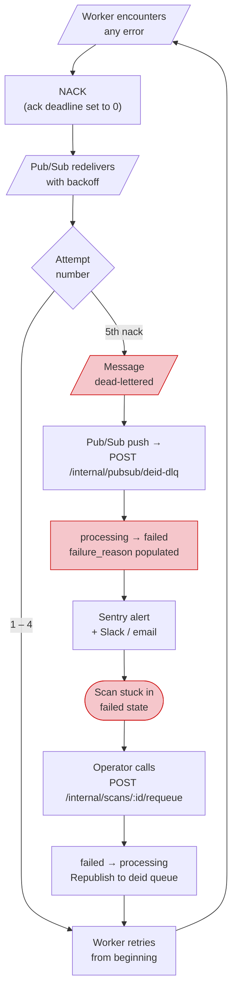
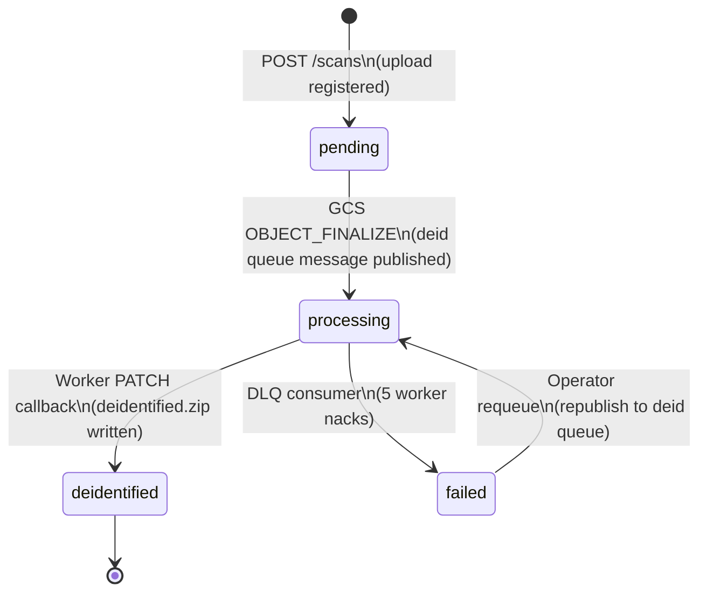
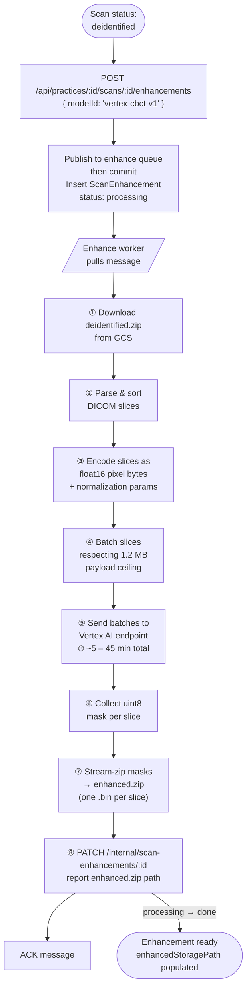
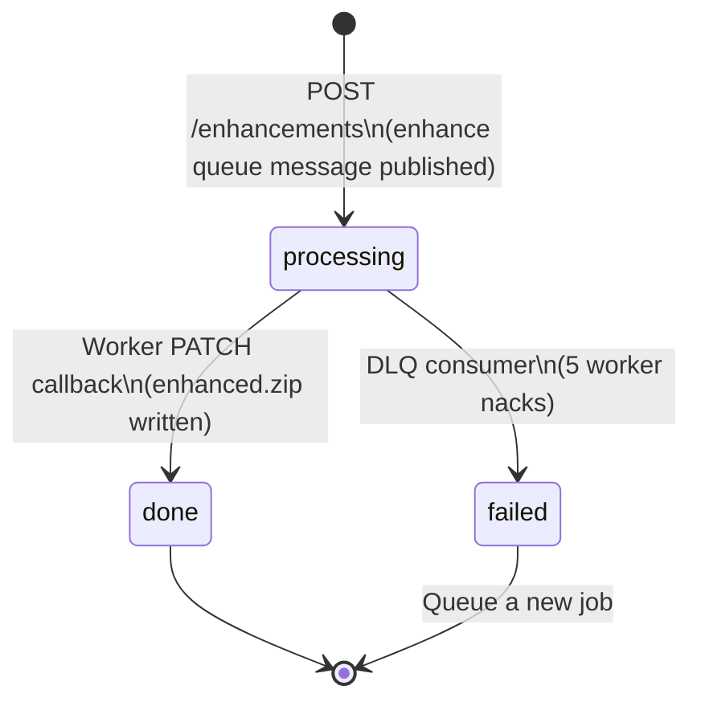
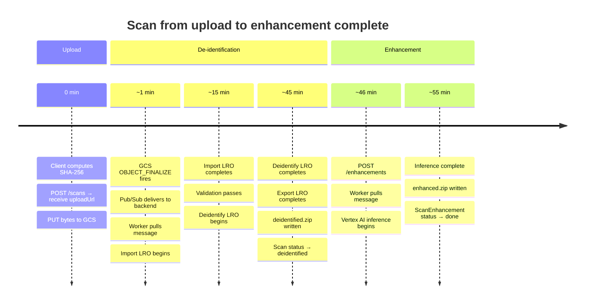

# Scan Pipeline: How It Works

This document explains the full lifecycle of a CBCT scan — from the moment a client computes a SHA-256 hash to the point where nerve segmentation masks are ready for download. No code is included here; see [Creating a Scan](./creating-a-scan.md) and [Enhancing a Scan](./enhancing-a-scan.md) for implementation guides.

***

## Overview

Processing a scan happens in two independent stages:

| Stage                 | What happens                                                              | Duration    |
| --------------------- | ------------------------------------------------------------------------- | ----------- |
| **De-identification** | PHI is stripped from DICOM metadata using the Google Cloud Healthcare API | 25 – 55 min |
| **Enhancement**       | AI nerve segmentation inference runs on the clean DICOM data              | 5 – 45 min  |

Enhancement cannot begin until de-identification completes. De-identification begins automatically when the upload lands in cloud storage — no second API call is required.

***

## Stage 1: Upload & De-identification

***

## Stage 1: Failure & Retry Paths

The deid worker **nacks on every error** — both transient and permanent. Pub/Sub redelivers automatically with exponential backoff. After five failed deliveries, the message is dead-lettered.

### What causes a permanent failure (requires re-upload)

| Failure point           | Cause                                    | Recoverable?                           |
| ----------------------- | ---------------------------------------- | -------------------------------------- |
| Import LRO              | ZIP contains no `.dcm` files             | No — re-upload required                |
| Validation              | More than one study or series in the ZIP | No — re-upload required                |
| Validation              | SOP Class UID not on CBCT allowlist      | No — re-upload required                |
| Deidentify LRO          | Healthcare API quota exceeded            | Yes — operator requeue                 |
| PATCH callback 404/409  | Scan row in unexpected state             | Yes — operator investigation           |
| Wall-clock cap (50 min) | LRO stalled indefinitely                 | Yes — operator requeue after diagnosis |

***

## Scan Status Lifecycle

> `valid` and `rejected` appear in the status allowlist for legacy rows only and are not part of the active pipeline.

***

## Stage 2: Enhancement

Enhancement is triggered explicitly via a separate API call after the scan reaches `deidentified`. A `ScanEnhancement` job is created — the scan's own status does not change.

***

## Enhancement: Failure & Retry Paths

Enhancement uses the same nack-based retry model as de-identification.

> Unlike the deid pipeline, there is no operator requeue endpoint for enhancements — create a new job via the API.

***

## ScanEnhancement Status Lifecycle

***

## Full End-to-End Timeline

 
