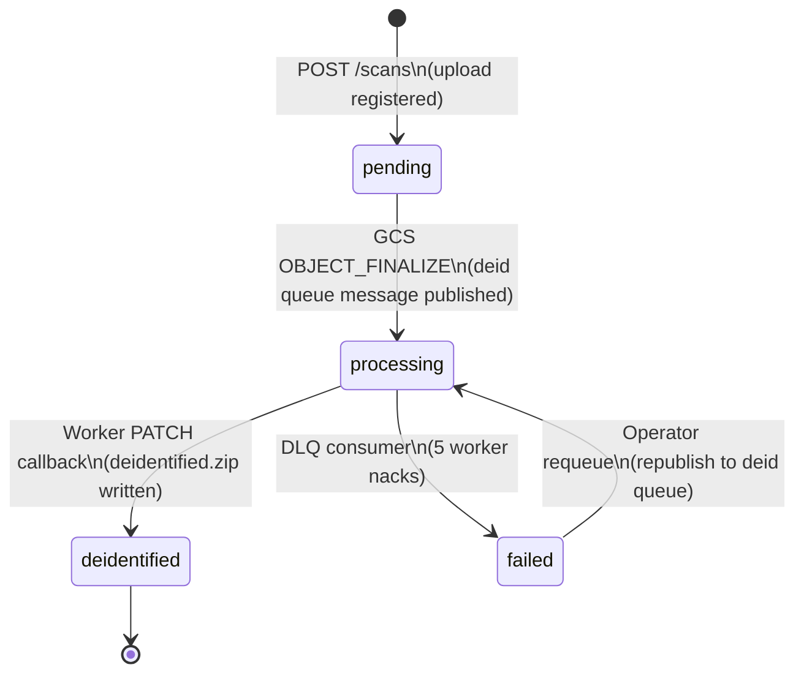
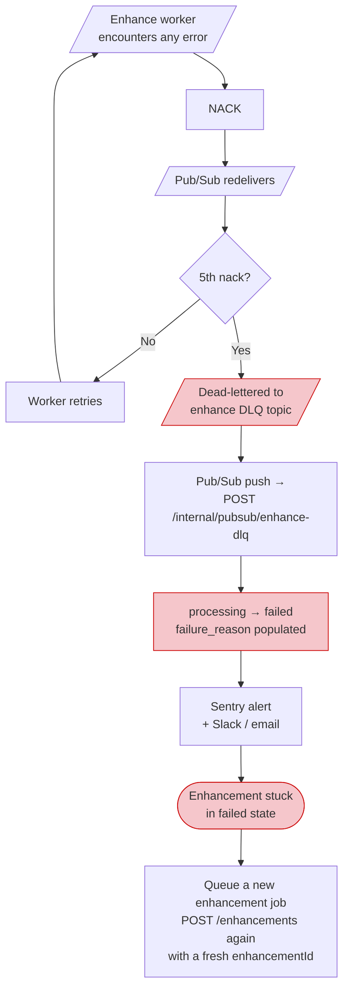
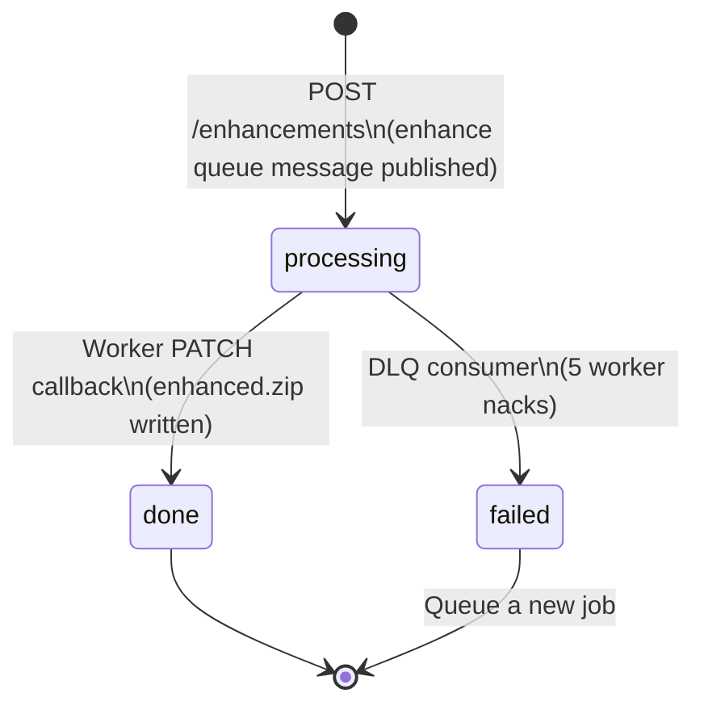
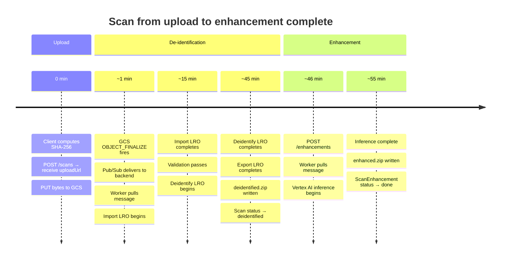

# PrognosiX Guide

This guide covers the full lifecycle of a dicom scan — from computing a SHA-256 hash to reading nerve segmentation masks. It is split into three sections: pipeline overview (diagrams only), creating and uploading a scan, and running AI enhancement.

***

## Table of Contents

- Part 1: Pipeline Overview
- Part 2: Creating a Scan
- Part 3: Enhancing a Scan

***

# Part 1: Pipeline Overview

Processing a scan happens in two independent stages:

| Stage                 | What happens                                                              | Duration    |
| --------------------- | ------------------------------------------------------------------------- | ----------- |
| **De-identification** | PHI is stripped from DICOM metadata using the Google Cloud Healthcare API | 25 – 55 min |
| **Enhancement**       | AI nerve segmentation inference runs on the clean DICOM data              | 5 – 45 min  |

Enhancement cannot begin until de-identification completes. De-identification begins automatically when the upload lands in cloud storage — no second API call is required.

***

## Stage 1: Upload & De-identification


***

## Stage 1: Failure & Retry Paths

The deid worker **nacks on every error** — both transient and permanent. Pub/Sub redelivers automatically with exponential backoff. After five failed deliveries, the message is dead-lettered.


### What causes a permanent failure (requires re-upload)

| Failure point           | Cause                                    | Recoverable?                           |
| ----------------------- | ---------------------------------------- | -------------------------------------- |
| Import LRO              | ZIP contains no `.dcm` files             | No — re-upload required                |
| Validation              | More than one study or series in the ZIP | No — re-upload required                |
| Validation              | SOP Class UID not on CBCT allowlist      | No — re-upload required                |
| Deidentify LRO          | Healthcare API quota exceeded            | Yes — operator requeue                 |
| PATCH callback 404/409  | Scan row in unexpected state             | Yes — operator investigation           |
| Wall-clock cap (50 min) | LRO stalled indefinitely                 | Yes — operator requeue after diagnosis |

***

## Scan Status Lifecycle



> `valid` and `rejected` appear in the status allowlist for legacy rows only and are not part of the active pipeline.

***

## Stage 2: Enhancement

Enhancement is triggered explicitly via a separate API call after the scan reaches `deidentified`. A `ScanEnhancement` job is created — the scan's own status does not change.


***

## Stage 2: Failure & Retry Paths

Enhancement uses the same nack-based retry model as de-identification.



> Unlike the deid pipeline, there is no operator requeue endpoint for enhancements — create a new job via the API.

***

## ScanEnhancement Status Lifecycle



***

## Full End-to-End Timeline



***

# Part 2: Creating a Scan

***

## Accepted Scan Format

Prognosix accepts **CBCT (Cone Beam CT)** scans packaged as a ZIP archive.

### ZIP Contents

The ZIP must contain DICOM files (`.dcm`) representing **exactly one study with exactly one series**. Files may be organized in subdirectories — the worker recurses through the entire archive. Non-DICOM files (`.txt`, `.xml`, thumbnails) are silently skipped.

| Requirement    | Detail                                    |
| -------------- | ----------------------------------------- |
| Format         | ZIP archive (`.zip`)                      |
| Contents       | `.dcm` DICOM files                        |
| Studies        | Exactly 1                                 |
| Series         | Exactly 1                                 |
| SOP Class UIDs | Must be on the CBCT allowlist (see below) |

### Accepted SOP Class UIDs

Every DICOM instance in the archive must have a `SOPClassUID` (tag `0008,0016`) from this allowlist:

| UID                           | Name                                                   |
| ----------------------------- | ------------------------------------------------------ |
| `1.2.840.10008.5.1.4.1.1.2`   | CT Image Storage                                       |
| `1.2.840.10008.5.1.4.1.1.2.1` | Enhanced CT Image Storage                              |
| `1.2.840.10008.5.1.4.1.1.163` | Legacy Converted Enhanced CT Image Storage             |
| `1.2.840.10008.5.1.4.1.1.2.2` | Legacy Converted Enhanced CT Image Storage (alternate) |

Scans containing unsupported SOP Class UIDs will fail during de-identification validation. This check runs after upload and is unrecoverable without re-uploading a corrected archive.

> **Transfer syntax** — Any transfer syntax is accepted at upload time. The Healthcare API normalizes output to **Explicit VR Little Endian (uncompressed)** during de-identification, which is required for downstream AI inference.

***

## Step 1: Compute the SHA-256

Before making any API call, compute the SHA-256 hash of the ZIP file. This hash is both the **deduplication key** and your upload receipt — the server never accepts bytes directly, so the hash is how it knows what to expect.

```python
import hashlib

def compute_sha256(file_path: str) -> str:
    h = hashlib.sha256()
    with open(file_path, "rb") as f:
        for chunk in iter(lambda: f.read(65536), b""):
            h.update(chunk)
    return h.hexdigest()

sha256 = compute_sha256("patient-cbct.zip")
# → "e3b0c44298fc1c149afbf4c8996fb92427ae41e4649b934ca495991b7852b855"
```

```javascript
import { createReadStream } from "fs";
import { createHash } from "crypto";

async function computeSha256(filePath) {
  return new Promise((resolve, reject) => {
    const hash = createHash("sha256");
    createReadStream(filePath)
      .on("data", (chunk) => hash.update(chunk))
      .on("end", () => resolve(hash.digest("hex")))
      .on("error", reject);
  });
}

const sha256 = await computeSha256("patient-cbct.zip");
```

***

## Step 2: Register the Scan

Send the SHA-256 (and optional metadata) to create a scan record and receive a GCS upload URL.

```http
POST /api/practices/{practice_id}/scans
Authorization: Bearer {token}
Content-Type: application/json
```

### Request Body

| Field       | Type    | Required | Description                                                                |
| ----------- | ------- | -------- | -------------------------------------------------------------------------- |
| `sha256`    | string  | **Yes**  | Lowercase hex SHA-256 of the ZIP. Must match `^[0-9a-f]{64}$`.             |
| `filename`  | string  | No       | Original filename — stored for display purposes only                       |
| `sizeBytes` | integer | No       | Compressed ZIP size in bytes — used as a hint for upload progress tracking |

```python
import httpx
import os

async def create_scan(practice_id: str, file_path: str, token: str) -> dict:
    sha256 = compute_sha256(file_path)
    size_bytes = os.path.getsize(file_path)
    filename = os.path.basename(file_path)

    async with httpx.AsyncClient() as client:
        resp = await client.post(
            f"https://api.prognosix.com/api/practices/{practice_id}/scans",
            headers={"Authorization": f"Bearer {token}"},
            json={
                "sha256": sha256,
                "filename": filename,
                "sizeBytes": size_bytes,
            },
        )
        resp.raise_for_status()
        return resp.json()
```

```bash
curl -X POST https://api.prognosix.com/api/practices/Z70B874W63DW/scans \
  -H "Authorization: Bearer $TOKEN" \
  -H "Content-Type: application/json" \
  -d '{
    "sha256": "e3b0c44298fc1c149afbf4c8996fb92427ae41e4649b934ca495991b7852b855",
    "filename": "patient-cbct.zip",
    "sizeBytes": 2147483648
  }'
```

### Response: 201 Created (new scan)

```json
{
  "success": true,
  "message": "Scan created successfully",
  "data": {
    "scan": {
      "id": "2cMqV3y0e1bJ7sFhqQ8xN4uZk9P",
      "practiceId": "Z70B874W63DW",
      "sha256": "e3b0c44298fc1c149afbf4c8996fb92427ae41e4649b934ca495991b7852b855",
      "storagePath": "Z70B874W63DW/2cMqV3y0e1bJ7sFhqQ8xN4uZk9P/source.zip",
      "status": "pending",
      "sizeBytes": 2147483648,
      "originalFilename": "patient-cbct.zip",
      "createdAt": "2026-06-01T10:30:00Z",
      "deidStoragePath": null,
      "failureReason": null
    },
    "uploadUrl": "https://storage.googleapis.com/upload/storage/v1/b/...",
    "uploadMethod": "PUT",
    "expiresAt": null
  }
}
```

### Response: 200 OK (scan already exists)

If you call this endpoint with the same `(practice_id, sha256)` pair a second time, the existing scan is returned without issuing a new upload URL. This is safe to call on retry — the original upload URL remains valid for \~7 days.

```json
{
  "success": true,
  "message": "Scan already exists",
  "data": {
    "scan": { "...": "existing scan object" },
    "uploadUrl": null,
    "uploadMethod": "PUT",
    "expiresAt": null
  }
}
```

When `uploadUrl` is `null`, the file was already uploaded previously — skip Step 3 and proceed to polling.

***

## Step 3: Upload the File to GCS

The `uploadUrl` is a **GCS resumable session URI**. Upload the ZIP directly to this URL — the file never passes through the Prognosix backend.

```python
async def upload_to_gcs(upload_url: str, file_path: str) -> None:
    size_bytes = os.path.getsize(file_path)

    async with httpx.AsyncClient(timeout=3600) as client:
        with open(file_path, "rb") as f:
            resp = await client.put(
                upload_url,
                content=f,
                headers={
                    "Content-Type": "application/zip",
                    "Content-Length": str(size_bytes),
                },
            )
        resp.raise_for_status()
```

```bash
curl -X PUT "$UPLOAD_URL" \
  -H "Content-Type: application/zip" \
  --upload-file patient-cbct.zip
```

### Resuming an interrupted upload

GCS resumable uploads can be resumed if the connection is lost. Query the current offset, then re-send only the remaining bytes:

```python
async def resume_gcs_upload(upload_url: str, file_path: str) -> None:
    size_bytes = os.path.getsize(file_path)

    async with httpx.AsyncClient() as client:
        query_resp = await client.put(
            upload_url,
            headers={
                "Content-Range": f"*/{size_bytes}",
                "Content-Length": "0",
            },
        )

    if query_resp.status_code == 308:
        range_header = query_resp.headers.get("range", "bytes=-1")
        uploaded_bytes = int(range_header.split("-")[1]) + 1
    elif query_resp.status_code in (200, 201):
        return  # Already complete
    else:
        raise RuntimeError(f"Unexpected GCS status: {query_resp.status_code}")

    async with httpx.AsyncClient(timeout=3600) as client:
        with open(file_path, "rb") as f:
            f.seek(uploaded_bytes)
            remaining = size_bytes - uploaded_bytes
            resp = await client.put(
                upload_url,
                content=f,
                headers={
                    "Content-Type": "application/zip",
                    "Content-Range": f"bytes {uploaded_bytes}-{size_bytes - 1}/{size_bytes}",
                    "Content-Length": str(remaining),
                },
            )
        resp.raise_for_status()
```

Once the upload completes, GCS automatically fires an `OBJECT_FINALIZE` event that triggers de-identification. No further API call is needed.

***

## Step 4: Poll for De-identification

De-identification runs asynchronously and takes **25–55 minutes** depending on scan size. Poll every **30 seconds**.

```http
GET /api/practices/{practice_id}/scans/{scan_id}
Authorization: Bearer {token}
```

```python
import asyncio

async def wait_for_deidentification(
    practice_id: str,
    scan_id: str,
    token: str,
    poll_interval: int = 30,
) -> dict:
    async with httpx.AsyncClient() as client:
        while True:
            resp = await client.get(
                f"https://api.prognosix.com/api/practices/{practice_id}/scans/{scan_id}",
                headers={"Authorization": f"Bearer {token}"},
            )
            resp.raise_for_status()
            scan = resp.json()["data"]

            match scan["status"]:
                case "deidentified":
                    print(f"✓ De-identified: {scan['deidStoragePath']}")
                    return scan
                case "failed":
                    raise RuntimeError(f"De-identification failed: {scan.get('failureReason')}")
                case _:
                    print(f"  status={scan['status']} — waiting {poll_interval}s…")
                    await asyncio.sleep(poll_interval)
```

```bash
while true; do
  SCAN=$(curl -s \
    -H "Authorization: Bearer $TOKEN" \
    "https://api.prognosix.com/api/practices/$PRACTICE_ID/scans/$SCAN_ID")

  STATUS=$(echo $SCAN | jq -r '.data.status')
  echo "status: $STATUS"

  if [ "$STATUS" = "deidentified" ]; then
    echo "De-identification complete"
    break
  elif [ "$STATUS" = "failed" ]; then
    echo "Failed: $(echo $SCAN | jq -r '.data.failureReason')"
    break
  fi

  sleep 30
done
```

### Scan Status Reference

| Status         | Meaning                                                                   |
| -------------- | ------------------------------------------------------------------------- |
| `pending`      | Scan registered; awaiting file upload or GCS event                        |
| `processing`   | De-identification pipeline is running                                     |
| `deidentified` | PHI stripped; scan is ready for enhancement                               |
| `failed`       | De-identification failed after all retries — `failureReason` is populated |

***

## Complete Example: Upload a Scan

```python
import asyncio
import hashlib
import os
import httpx

BASE_URL = "https://api.prognosix.com"

def compute_sha256(file_path: str) -> str:
    h = hashlib.sha256()
    with open(file_path, "rb") as f:
        for chunk in iter(lambda: f.read(65536), b""):
            h.update(chunk)
    return h.hexdigest()

async def upload_scan(practice_id: str, file_path: str, token: str) -> dict:
    headers = {"Authorization": f"Bearer {token}"}

    sha256 = compute_sha256(file_path)
    print(f"SHA-256: {sha256}")

    async with httpx.AsyncClient() as client:
        resp = await client.post(
            f"{BASE_URL}/api/practices/{practice_id}/scans",
            headers={**headers, "Content-Type": "application/json"},
            json={
                "sha256": sha256,
                "filename": os.path.basename(file_path),
                "sizeBytes": os.path.getsize(file_path),
            },
        )
        resp.raise_for_status()
        result = resp.json()["data"]

    scan = result["scan"]
    upload_url = result.get("uploadUrl")
    print(f"Scan ID: {scan['id']} | status: {scan['status']}")

    if upload_url:
        print("Uploading to GCS…")
        async with httpx.AsyncClient(timeout=3600) as client:
            with open(file_path, "rb") as f:
                put_resp = await client.put(
                    upload_url,
                    content=f,
                    headers={
                        "Content-Type": "application/zip",
                        "Content-Length": str(os.path.getsize(file_path)),
                    },
                )
            put_resp.raise_for_status()
        print("Upload complete — de-identification pipeline started")
    else:
        print("File already uploaded — skipping")

    print("Polling for de-identification (25–55 min)…")
    async with httpx.AsyncClient() as client:
        while True:
            resp = await client.get(
                f"{BASE_URL}/api/practices/{practice_id}/scans/{scan['id']}",
                headers=headers,
            )
            resp.raise_for_status()
            scan = resp.json()["data"]

            match scan["status"]:
                case "deidentified":
                    print(f"✓ Ready for enhancement (scan ID: {scan['id']})")
                    return scan
                case "failed":
                    raise RuntimeError(f"De-identification failed: {scan.get('failureReason')}")
                case _:
                    print(f"  {scan['status']} — checking again in 30s…")
                    await asyncio.sleep(30)

scan = asyncio.run(upload_scan("Z70B874W63DW", "patient-cbct.zip", "your_token"))
```

***

## Error Reference: Creating a Scan

| Status Code | Meaning                                           |
| ----------- | ------------------------------------------------- |
| `201`       | Scan created; `uploadUrl` present                 |
| `200`       | Scan already exists; `uploadUrl` is `null`        |
| `400`       | Missing or malformed `sha256`                     |
| `401`       | Missing or invalid bearer token                   |
| `404`       | Practice not found                                |
| `422`       | Validation error on request body                  |
| `500`       | Internal error — contact support if this persists |

***

# Part 3: Enhancing a Scan

***

## Prerequisites

Enhancement requires the scan to be in `deidentified` status. Check before proceeding:

```python
scan = await get_scan(practice_id, scan_id, token)

if scan["status"] != "deidentified":
    raise RuntimeError(
        f"Scan is not ready for enhancement (status: {scan['status']}). "
        "Wait for de-identification to complete first."
    )
```

***

## Step 1: Queue an Enhancement Job

```http
POST /api/practices/{practice_id}/scans/{scan_id}/enhancements
Authorization: Bearer {token}
Content-Type: application/json
```

### Request Body

| Field     | Type   | Required | Description                                                            |
| --------- | ------ | -------- | ---------------------------------------------------------------------- |
| `modelId` | string | **Yes**  | The model to run inference with. Currently supported: `vertex-cbct-v1` |

```python
async def create_enhancement(
    practice_id: str,
    scan_id: str,
    token: str,
    model_id: str = "vertex-cbct-v1",
) -> dict:
    async with httpx.AsyncClient() as client:
        resp = await client.post(
            f"https://api.prognosix.com/api/practices/{practice_id}/scans/{scan_id}/enhancements",
            headers={"Authorization": f"Bearer {token}"},
            json={"modelId": model_id},
        )
        resp.raise_for_status()
        return resp.json()["data"]

enhancement = await create_enhancement(practice_id, scan_id, token)
print(f"Enhancement ID: {enhancement['id']}")  # save this
print(f"Status: {enhancement['status']}")       # → "processing"
```

```bash
curl -X POST \
  "https://api.prognosix.com/api/practices/$PRACTICE_ID/scans/$SCAN_ID/enhancements" \
  -H "Authorization: Bearer $TOKEN" \
  -H "Content-Type: application/json" \
  -d '{"modelId": "vertex-cbct-v1"}'
```

### Response: 201 Created

```json
{
  "success": true,
  "message": "Enhancement job queued",
  "data": {
    "id": "2dNrW4z1f2cK8tGirR9yO5vAl0Q",
    "scanId": "2cMqV3y0e1bJ7sFhqQ8xN4uZk9P",
    "modelId": "vertex-cbct-v1",
    "status": "processing",
    "enhancedStoragePath": null,
    "failureReason": null,
    "createdAt": "2026-06-01T10:30:00Z"
  }
}
```

Save the `id` — this is your enhancement job ID. The scan's own `status` does not change; enhancement progress is tracked on this `ScanEnhancement` object.

***

## Step 2: Poll for Completion

Enhancement takes **5–45 minutes** depending on scan size and model load. Poll every **30–60 seconds**.

```python
async def wait_for_enhancement(
    practice_id: str,
    scan_id: str,
    enhancement_id: str,
    token: str,
    poll_interval: int = 30,
) -> dict:
    async with httpx.AsyncClient() as client:
        while True:
            resp = await client.get(
                f"https://api.prognosix.com/api/practices/{practice_id}/scans/{scan_id}",
                headers={"Authorization": f"Bearer {token}"},
            )
            resp.raise_for_status()
            scan = resp.json()["data"]

            enhancements = scan.get("enhancements", [])
            enhancement = next(
                (e for e in enhancements if e["id"] == enhancement_id),
                None,
            )

            if enhancement is None:
                raise RuntimeError(f"Enhancement {enhancement_id} not found on scan")

            match enhancement["status"]:
                case "done":
                    print(f"✓ Enhancement complete: {enhancement['enhancedStoragePath']}")
                    return enhancement
                case "failed":
                    raise RuntimeError(
                        f"Enhancement failed: {enhancement.get('failureReason')}"
                    )
                case "processing":
                    print(f"  processing — checking again in {poll_interval}s…")
                    await asyncio.sleep(poll_interval)
```

```bash
while true; do
  SCAN=$(curl -s \
    -H "Authorization: Bearer $TOKEN" \
    "https://api.prognosix.com/api/practices/$PRACTICE_ID/scans/$SCAN_ID")

  STATUS=$(echo $SCAN | jq -r \
    --arg ID "$ENHANCEMENT_ID" \
    '.data.enhancements[] | select(.id == $ID) | .status')

  echo "enhancement status: $STATUS"

  case "$STATUS" in
    done)
      echo "Enhancement complete"
      echo $SCAN | jq -r \
        --arg ID "$ENHANCEMENT_ID" \
        '.data.enhancements[] | select(.id == $ID) | .enhancedStoragePath'
      break
      ;;
    failed)
      echo "Enhancement failed"
      echo $SCAN | jq -r \
        --arg ID "$ENHANCEMENT_ID" \
        '.data.enhancements[] | select(.id == $ID) | .failureReason'
      break
      ;;
  esac

  sleep 30
done
```

### ScanEnhancement Status Reference

| Status       | Meaning               | `enhancedStoragePath` | `failureReason` |
| ------------ | --------------------- | --------------------- | --------------- |
| `processing` | Inference is running  | `null`                | `null`          |
| `done`       | Masks written to GCS  | populated             | `null`          |
| `failed`     | All retries exhausted | `null`                | populated       |

***

## Step 3: Download and Read the Output

When `status` is `done`, `enhancedStoragePath` holds the GCS path to a ZIP of per-slice nerve segmentation masks.

### Output ZIP Structure

```
enhanced.zip
├── mask_000000.bin   ← first slice in anatomical order
├── mask_000001.bin
├── mask_000002.bin
│   ...
└── mask_NNN.bin      ← last slice
```

Each `.bin` file is a flat `uint8` array — one byte per pixel — representing the argmax class label at that position. Slice dimensions match the original DICOM source (e.g., 551 × 551).

### Reading Masks in Python

```python
import zipfile
import numpy as np

def read_masks(zip_path: str, slice_height: int, slice_width: int) -> list[np.ndarray]:
    masks = []
    with zipfile.ZipFile(zip_path) as zf:
        for entry in sorted(zf.namelist()):
            if not entry.endswith(".bin"):
                continue
            with zf.open(entry) as f:
                raw = f.read()
            mask = np.frombuffer(raw, dtype=np.uint8).reshape((slice_height, slice_width))
            masks.append(mask)
    return masks

masks = read_masks("enhanced.zip", slice_height=551, slice_width=551)
print(f"Loaded {len(masks)} slices")
print(f"Mask shape: {masks[0].shape}")        # (551, 551)
print(f"Unique labels: {np.unique(masks[0])}") # e.g. [0 1 2]
```

### Visualizing a Single Slice

```python
import matplotlib.pyplot as plt

plt.imshow(masks[100], cmap="tab10", vmin=0, vmax=7)
plt.colorbar(label="Class label")
plt.title("Nerve segmentation — slice 100")
plt.show()
```

### Stacking Slices into a 3D Volume

```python
volume = np.stack(masks, axis=0)
# volume.shape → (num_slices, height, width)
# volume[z, y, x] → class label at voxel (z, y, x)

print(f"Volume shape: {volume.shape}")
print(f"Nerve voxel count (label=1): {np.sum(volume == 1)}")
```

***

## Handling Failures

If `status` is `failed`, all automatic retries were exhausted. The `failureReason` field describes the cause.

```json
{
  "status": "failed",
  "failureReason": "enhancement dead-lettered after max delivery attempts",
  "enhancedStoragePath": null
}
```

A failed enhancement job cannot be retried in-place — queue a new job with a fresh `id`:

```python
async def retry_enhancement(practice_id: str, scan_id: str, token: str) -> dict:
    scan = await get_scan(practice_id, scan_id, token)
    if scan["status"] != "deidentified":
        raise RuntimeError(f"Cannot retry: scan status is '{scan['status']}'")
    return await create_enhancement(practice_id, scan_id, token)
```

***

## Complete Example: Enhance a Scan

```python
import asyncio
import httpx
import zipfile
import numpy as np

BASE_URL = "https://api.prognosix.com"

async def enhance_scan(
    practice_id: str,
    scan_id: str,
    token: str,
    output_path: str = "enhanced.zip",
) -> list[np.ndarray]:
    headers = {"Authorization": f"Bearer {token}"}

    async with httpx.AsyncClient() as client:
        # Verify scan is deidentified
        resp = await client.get(
            f"{BASE_URL}/api/practices/{practice_id}/scans/{scan_id}",
            headers=headers,
        )
        resp.raise_for_status()
        scan = resp.json()["data"]

        if scan["status"] != "deidentified":
            raise RuntimeError(f"Expected 'deidentified', got '{scan['status']}'")

        # Queue enhancement
        resp = await client.post(
            f"{BASE_URL}/api/practices/{practice_id}/scans/{scan_id}/enhancements",
            headers={**headers, "Content-Type": "application/json"},
            json={"modelId": "vertex-cbct-v1"},
        )
        resp.raise_for_status()
        enhancement = resp.json()["data"]
        enhancement_id = enhancement["id"]
        print(f"Enhancement queued: {enhancement_id}")

        # Poll until terminal
        while True:
            await asyncio.sleep(30)

            resp = await client.get(
                f"{BASE_URL}/api/practices/{practice_id}/scans/{scan_id}",
                headers=headers,
            )
            resp.raise_for_status()
            enhancements = resp.json()["data"].get("enhancements", [])
            enhancement = next(e for e in enhancements if e["id"] == enhancement_id)

            match enhancement["status"]:
                case "done":
                    print(f"✓ Done — {enhancement['enhancedStoragePath']}")
                    break
                case "failed":
                    raise RuntimeError(f"Enhancement failed: {enhancement.get('failureReason')}")
                case _:
                    print(f"  processing…")

    # Download and read masks
    # download_from_gcs(enhancement["enhancedStoragePath"], output_path)
    # return read_masks(output_path, slice_height=551, slice_width=551)


asyncio.run(enhance_scan("Z70B874W63DW", "2cMqV3y0e1bJ7sFhqQ8xN4uZk9P", "your_token"))
```

***

## Error Reference: Enhancing a Scan

| Status Code | Meaning                                           |
| ----------- | ------------------------------------------------- |
| `201`       | Enhancement job queued                            |
| `400`       | Invalid request body (unrecognized `modelId`)     |
| `401`       | Missing or invalid bearer token                   |
| `404`       | Practice or scan not found                        |
| `409`       | Scan is not in `deidentified` state               |
| `500`       | Internal error — contact support if this persists |

<br />
