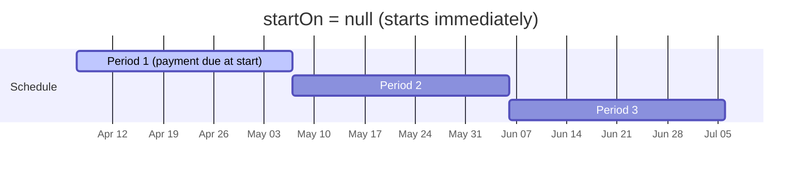
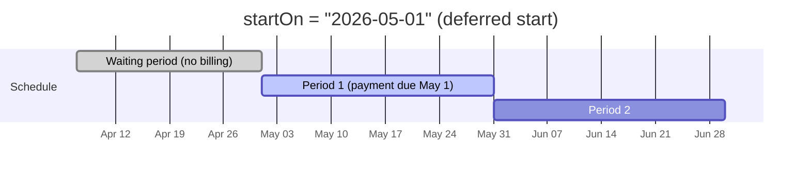
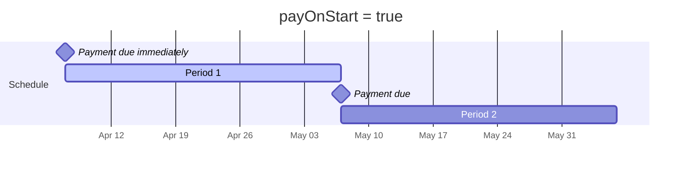
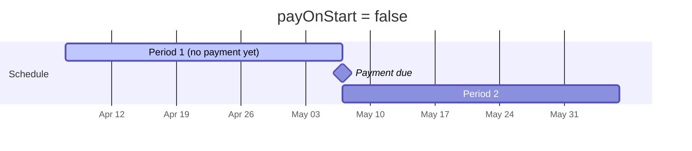

At it's core, an Order is just a way to organize and manage payments. You can set due dates, schedule recurring payments, or send an invoice directly to customers. An order can be used for something as simple as splitting a single charge into multiple payment methods (e.g. splitting a bill between two cards) or as complex as a payment plan with autopay. In any case, the goal is the same, provide an interface that you can "set and forget." You specify the parameters for the order, and we'll handle the rest. 

## Order basics

An order is a record that links one or more payments to a product or service. At its simplest, all you need is an `amount` and a `description` and you're good to go. From there, you can attach payments to the order via the API (by setting the `orderId` field on a payment request) or send your customer a link to the order's invoice page where they can pay directly.

### Creating an order

Use the create-or-update endpoint to create an order:

```
POST /n1/merchant/{merchantId}/order/{orderId?}
```

The `orderId` in the URL is optional. Provide your own ID (like an internal invoice number) or omit it to let the API generate one automatically. This endpoint is an **upsert** — if an order with that ID already exists, it will be updated instead.

```json
{
  "description": "Teeth cleaning - June 2026",
  "amount": 250.00
}
```

**Response** `201 Created`:

```json
{
  "success": true,
  "statusCode": 201,
  "data": {
      "id": "YXFS-VX62",
      "merchantId": "Z70B874W63DW",
      "description": "Teeth cleaning - June 2026",
      "amount": 250,
      "remainingBalance": 250,
      "currency": "USD",
      "type": "UNSCHEDULED",
      "status": "PENDING",
      "customers": [],
      "payments": [],
      "invoiceEmailSends": [],
      "invoiceSmsSends": [],
      "creationTime": "2026-04-08T04:32:40.000+00:00",
      "lastUpdatedTime": "2026-04-08T04:32:40.000+00:00",
      "invoiceUrl": "https://prahsys-gateway.test/order/019d6b5d-2986-73ec-82af-de515daa76ee/invoice?expires=1780806760&signature=..."
    }
}
```

### Collecting payment

There are two ways to collect payment on an order:

* **Via the API** — when creating a payment, set the `orderId` field in the payment request body to associate it with the order. The order's `remainingBalance` and `status` update automatically as payments are captured.
* **Via the invoice page** — every order response includes an `invoiceUrl`. Send this link to your customer and they can make payments directly through the hosted invoice page.

## View and send invoice links

Every order has a hosted invoice page where customers can view what they owe and make payments. The `invoiceUrl` is included in every order response body.

> ⚠️ Unique signatures
>
> The invoice URL contains a unique signature that is regenerated each time you retrieve the order. Don't store these URLs long-term — fetch a fresh one from the API when you need it.

### Sending invoices

Use the send endpoint to deliver the invoice link via email or SMS:

```
POST /n1/merchant/{merchantId}/order/{orderId}/send
```

**Method 1: Send to customers on the order.** Use the boolean flags to send to all emails or phone numbers of customers attached to the order:

```json
{
  "sendToCustomerEmails": true,
  "sendToCustomerPhones": false
}
```

**Method 2: Send to specific addresses.** Provide your own list of recipients. When you provide `emails`, the `sendToCustomerEmails` flag is ignored (same for `phoneNumbers` and `sendToCustomerPhones`):

```json
{
  "emails": ["billing@example.com", "jane@example.com"],
  "phoneNumbers": ["+15551234567"]
}
```

## Attaching customers

You can attach one or more customers to an order by including a `customers` array when creating or updating the order:

```json
{
  "description": "Teeth cleaning - June 2026",
  "amount": 250.00,
  "customers": [
    {
      "firstName": "Jane",
      "lastName": "Smith",
      "email": "jane@example.com",
      "phone": "+15551234567"
    }
  ]
}
```

Attaching customers helps with your own record keeping, but it also sets the contacts for the order. When you send invoices using the boolean flags (`sendToCustomerEmails`, `sendToCustomerPhones`), these are the recipients. Customers also receive email and SMS notifications for pay schedule reminders, past due notices, and receipts.

## Setting a due date

You can set a `dueDate` on an order to indicate when payment is expected. Once the due date passes and the order still has an outstanding balance, the order status changes to `PAST_DUE`.

```json
{
  "description": "Teeth cleaning - June 2026",
  "amount": 250.00,
  "dueDate": "2026-06-15",
  "customers": [
    {
      "email": "jane@example.com",
      "firstName": "Jane",
      "lastName": "Smith"
    }
  ]
}
```

> ⚠️ Heads up
>
> `dueDate` is only for orders **without** a pay schedule. If you add a `paySchedule`, the schedule manages its own due dates automatically. The two fields are mutually exclusive.

## Creating a pay schedule: subscriptions & payment plans

A pay schedule turns an order into a recurring billing arrangement. There are two kinds, and the API determines which one based on whether the order has an `amount`:

* **Payment plan** — the order has a total `amount`. Payments recur until the balance is paid in full. A fixed minimum (`recurringAmount`) is due each period, but the customer can make extra payments to pay it off early. Once `remainingBalance` hits zero, the order moves to `PAID` and the schedule automatically deactivates.

  _Example: A patient owes $1,200 for dental work and pays $200/month over 6 months._

* **Subscription** — the order has **no** `amount` (null or omitted). A fixed `recurringAmount` is charged each period indefinitely until you cancel the schedule. Extra payments are not allowed.

  _Example: A gym charges $49.99/month for a membership with no end date._

### Required fields

When adding a `paySchedule` to an order, two fields are required:

* `recurringAmount` — the amount due each period
* `frequency` — how often a payment is due: `DAILY`, `WEEKLY`, `BI_WEEKLY`, `MONTHLY`, or `YEARLY`

### Payment plan example

```json
{
  "description": "Dental implant - payment plan",
  "amount": 1200.00,
  "customers": [
    {
      "firstName": "Maria",
      "lastName": "Gonzalez",
      "email": "maria@example.com"
    }
  ],
  "paySchedule": {
    "recurringAmount": 200.00,
    "frequency": "MONTHLY"
  }
}
```

The response will have `"type": "PAYMENT_PLAN"` because both `amount` and `paySchedule` are present.

### Subscription example

```json
{
  "description": "Monthly gym membership",
  "customers": [
    {
      "firstName": "Alex",
      "lastName": "Chen",
      "email": "alex@example.com"
    }
  ],
  "paySchedule": {
    "recurringAmount": 49.99,
    "frequency": "MONTHLY"
  }
}
```

The response will have `"type": "SUBSCRIPTION"` because `amount` is omitted and `paySchedule` is present.

### How a pay schedule works without autopay

If autopay is not enabled, the schedule doesn't charge the customer automatically. Instead, each period the system:

1. Checks whether the customer has made a payment on the order
2. Sends email reminders before the due date (configurable via `reminderBeforeDueDays`)
3. Sends an invoice at the start of each new period
4. Marks the order as past due if the customer misses a pay period

The customer pays manually — either through the invoice page or through a payment you process via the API.

### Two-step activation

> ❗ Important
>
> Creating an order with a `paySchedule` does **not** start billing. The schedule remains inactive (`"isActive": false`) until you explicitly start it. See [Starting a pay schedule](#starting-a-pay-schedule) below.

## Setting up autopay

Autopay means the system automatically charges the customer's stored payment method on each due date. If a charge fails, it retries on the days you configure with `retryAfterDueDays`.

### Requirements

To use autopay, you need a **pay token** attached to the pay schedule's billing. A pay token is a tokenized payment method that can be charged repeatedly. You can attach one in two ways:

**Option 1: Set the token directly.** If you already have a pay token, pass it in the `paySchedule.billing.token` field when creating or updating the order:

```json
{
  "description": "Monthly gym membership",
  "paySchedule": {
    "recurringAmount": 49.99,
    "frequency": "MONTHLY",
    "autopay": true,
    "billing": {
      "token": "pt_abc123def456"
    }
  }
}
```

**Option 2: Provide a session when starting.** If you're using Prahsys session iframes to collect card details, you can pass a `session.id` in the start request instead. The system will automatically pull the card info from the session and tokenize it at the time of starting. The session iframes must contain the required card fields for tokenization.

## Starting a pay schedule

There are two ways to start a pay schedule:

* **Manually via the API** — call the start endpoint yourself (described below)
* **Let the customer start it** — send the order invoice. If the order has an inactive pay schedule, the invoice page gives the customer the option to add a billing method and start the subscription or payment plan themselves.

### Start endpoint

```
POST /n1/merchant/{merchantId}/order/{orderId}/pay-schedule/start
```

```json
{
  "payOnStart": true
}
```

If autopay is enabled, a pay token must be attached to the pay schedule's billing before this endpoint is called. Alternatively, provide a `session.id` in the request body and the card will be tokenized automatically:

```json
{
  "payOnStart": true,
  "session": {
    "id": "ses_abc123def456"
  }
}
```

### The `startOn` parameter

Use `startOn` to defer the start of the schedule to a future date. This is useful when a customer signs up today but their first billing period shouldn't begin until later — for example, a gym membership that starts on the first of next month.

```json
{
  "payOnStart": true,
  "startOn": "2026-05-01"
}
```





When `startOn` is set, no payment is processed immediately regardless of other parameters. An invoice is sent to the customer instead, and the first payment is due on the `startOn` date (if `payOnStart` is true) or one period after (if `payOnStart` is false).

### The `payOnStart` parameter

`payOnStart` controls whether a payment is due at the **beginning** or **end** of the first period.





* **`payOnStart: true`** — a payment is processed immediately (or due on the `startOn` date if set). This requires either a `billing.token` on the pay schedule or a `session.id` in the request.
* **`payOnStart: false`** — no payment is made at the start. The first payment is due one full period later. An invoice is sent to the customer.

## Cancelling a pay schedule

```
POST /n1/merchant/{merchantId}/order/{orderId}/pay-schedule/cancel
```

Cancelling a pay schedule deactivates it immediately. All upcoming due dates and scheduled reminders are cleared, and a cancellation email is sent to the customer.

> ⚠️ Restrictions
>
> * The pay schedule must be active to cancel it.
> * You cannot cancel a pay schedule that has an outstanding past due balance. The customer must pay what they owe for past periods before the schedule can be cancelled.
