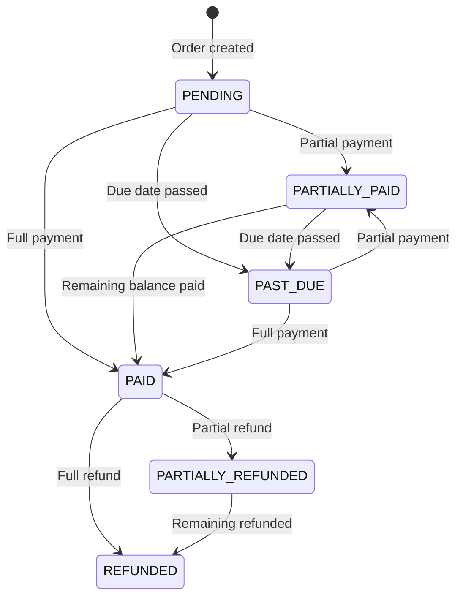

---
title: "Orders"
slug: "orders"
excerpt: "Create invoices, set up subscriptions, and manage payment plans — all through the Order resource."
---

An order is a record that links one or more payments to a product or service. You create an order, optionally send your customer an invoice, and the order tracks every payment until the balance is settled. Every order automatically gets a hosted invoice page where customers can view what they owe and make payments.

Orders come in three flavors — one-time invoices, payment plans, and subscriptions — but you never set the type directly. The API figures it out from the fields you provide.

## Order types at a glance

| | Unscheduled | Payment Plan | Subscription |
|---|---|---|---|
| **What it is** | A simple invoice for a fixed amount | A total balance split into recurring installments | An open-ended recurring charge |
| **Has `paySchedule`?** | No | Yes | Yes |
| **Has `amount`?** | Yes | Yes (total owed) | No (`null` or omitted) |
| **Extra payments?** | Yes | Yes — pay it off early | No |
| **Ends when** | Paid in full | Paid in full | Explicitly cancelled |
| **Example use case** | One-time invoice, deposit | Dental work financed over 6 months | Monthly membership fee |

> 📘 How the API determines the type
>
> You never send a `type` field. The API infers it automatically:
>
> | `paySchedule` | `amount` | Resulting `type` |
> |---|---|---|
> | Absent | Set (e.g. `250.00`) | `UNSCHEDULED` |
> | Present | Set (e.g. `1200.00`) | `PAYMENT_PLAN` |
> | Present | `null` or omitted | `SUBSCRIPTION` |

## Order lifecycle

Orders move through statuses automatically as payments come in and time passes.



> 📘 Subscription statuses
>
> Subscriptions have their own status flow: `SUBSCRIPTION_NOT_STARTED` → `SUBSCRIPTION_ACTIVE` → `SUBSCRIPTION_CANCELLED`. See the [Subscriptions Guide](subscriptions) for details.

## Status reference

**All order types:**

| Status | Description |
|---|---|
| `PENDING` | Awaiting payment |
| `PARTIALLY_PAID` | Some payment received, balance remaining |
| `PAID` | Fully paid — `remainingBalance` is 0 |
| `PAST_DUE` | Due date passed with outstanding balance |
| `REFUNDED` | All captured payments fully refunded |
| `PARTIALLY_REFUNDED` | Partial refund issued |

**Subscription-only:**

| Status | Description |
|---|---|
| `SUBSCRIPTION_NOT_STARTED` | Pay schedule configured but not yet activated |
| `SUBSCRIPTION_ACTIVE` | Running and current on payments |
| `SUBSCRIPTION_PAST_DUE` | A scheduled payment was missed |
| `SUBSCRIPTION_CANCELLED` | Cancelled — customer still owes through the current billing period |

## Working with unscheduled orders

An unscheduled order is the simplest type — create it, send an invoice, collect payment.

### Create an order

```
POST /n1/merchant/{merchantId}/order
```

```json
{
  "description": "Teeth cleaning - June 2026",
  "amount": 250.00,
  "currency": "USD",
  "dueDate": "2026-06-15",
  "customers": [
    {
      "firstName": "Jane",
      "lastName": "Smith",
      "email": "jane@example.com"
    }
  ]
}
```

**Response** `201 Created`:

```json
{
  "success": true,
  "statusCode": 201,
  "data": {
    "id": "ord_a1b2c3d4e5",
    "merchantId": "mch_x9y8z7",
    "description": "Teeth cleaning - June 2026",
    "amount": 250.00,
    "remainingBalance": 250.00,
    "currency": "USD",
    "type": "UNSCHEDULED",
    "status": "PENDING",
    "dueDate": "2026-06-15",
    "pastDue": false,
    "paySchedule": null,
    "customers": [
      {
        "id": "cus_f4e5d6",
        "firstName": "Jane",
        "lastName": "Smith",
        "email": "jane@example.com"
      }
    ],
    "payments": [],
    "invoiceUrl": "https://pay.prahsys.com/order/abc123/invoice?signature=...",
    "creationTime": "2026-04-07T14:30:00Z",
    "lastUpdatedTime": "2026-04-07T14:30:00Z"
  }
}
```

> 📘 Custom or auto-generated IDs
>
> The `orderId` in the URL is optional. Omit it to let the API generate one, or provide your own (like an internal invoice number): `POST /n1/merchant/{merchantId}/order/INV-2026-001`. The endpoint is an upsert — if the ID already exists, the order is updated.

### Send the invoice

Send the invoice link to your customer via email, SMS, or both.

```
POST /n1/merchant/{merchantId}/order/{orderId}/send
```

```json
{
  "sendToCustomerEmails": true
}
```

This emails the invoice link to all customers on the order. You can also send to specific addresses or phone numbers:

```json
{
  "emails": ["billing@example.com", "jane@example.com"],
  "phoneNumbers": ["+15551234567"]
}
```

> 📘 Send options
>
> If you provide `emails`, the `sendToCustomerEmails` flag is ignored (same for `phoneNumbers` and `sendToCustomerPhones`).

### Check order status

```
GET /n1/merchant/{merchantId}/order/{orderId}
```

After a $150 partial payment, the response reflects the updated state:

```json
{
  "success": true,
  "data": {
    "id": "ord_a1b2c3d4e5",
    "amount": 250.00,
    "remainingBalance": 100.00,
    "type": "UNSCHEDULED",
    "status": "PARTIALLY_PAID",
    "dueDate": "2026-06-15",
    "pastDue": false,
    "payments": [
      {
        "amount": 150.00,
        "currency": "USD",
        "status": "CAPTURED",
        "creationTime": "2026-04-10T09:15:22Z"
      }
    ]
  }
}
```

The `remainingBalance` dropped from 250 to 100, and `status` changed to `PARTIALLY_PAID`. Once the remaining $100 is paid, the order moves to `PAID`.

## Subscriptions and payment plans

Both subscriptions and payment plans add a `paySchedule` to the order that defines recurring billing. The key difference is whether the order has a total `amount`.

### Payment plans

A payment plan wraps a total balance in a recurring schedule. You set `amount` (the total owed) plus a `paySchedule` with a `frequency` and `recurringAmount`. The minimum is due each period, but the customer can make extra payments to pay it off early. Once `remainingBalance` hits zero, the order moves to `PAID` and the schedule automatically deactivates.

### Subscriptions

A subscription has a `paySchedule` but no total `amount`. A fixed `recurringAmount` is charged each period indefinitely. Extra payments are not allowed. The subscription stays active until you explicitly cancel it. Cancelling still requires the customer to pay through the next due date — no new due dates are added going forward.

### Shared concepts

Both types support:

- **Autopay** — automatically charge a stored payment method on each due date
- **Manual payment** — send invoices and let the customer pay through the hosted invoice page
- **Reminders** — configurable notifications sent before the due date
- **Retries** — automatic retry attempts after failed autopay charges
- **Two-step activation** — create the order with a `paySchedule`, then start it with a separate API call

> ⚠️ Two-step activation
>
> Creating an order with a `paySchedule` does **not** start billing. You must call the start endpoint separately:
> `POST /n1/merchant/{merchantId}/order/{orderId}/pay-schedule/start`

> 📘 Detailed guides
>
> - [Payment Plans Guide](payment-plans) — step-by-step examples for creating, starting, and managing payment plans
> - [Subscriptions Guide](subscriptions) — step-by-step examples for creating, starting, and cancelling subscriptions

## The invoice page

Every order includes an `invoiceUrl` in the response — a hosted page where your customer can view what they owe and make a payment. You can share this link directly or send it through the `/send` endpoint.

The invoice page shows the order status, amount due, and payment history. Customers can make payments directly from the page for any order type — except subscriptions with autopay, where the page is view-only since payments are charged automatically.

## Key endpoints

| Method | Endpoint | Description |
|---|---|---|
| `POST` | `/n1/merchant/{merchantId}/order/{orderId?}` | Create or update an order (upsert) |
| `GET` | `/n1/merchant/{merchantId}/order/{orderId}` | Get an order |
| `GET` | `/n1/merchant/{merchantId}/orders` | List orders with filtering, sorting, and pagination |
| `PUT` | `/n1/merchant/{merchantId}/order/{orderId}` | Partial update |
| `DELETE` | `/n1/merchant/{merchantId}/order/{orderId}` | Delete an order |
| `POST` | `/n1/merchant/{merchantId}/order/{orderId}/send` | Send invoice via email/SMS |
| `POST` | `.../order/{orderId}/pay-schedule/start` | Start a pay schedule |
| `POST` | `.../order/{orderId}/pay-schedule/cancel` | Cancel a pay schedule |

> ⚠️ Heads up
>
> - `dueDate` and `paySchedule` are **mutually exclusive**. Use `dueDate` for unscheduled orders, `paySchedule` for subscriptions and payment plans.
> - Orders with processed payments **cannot be deleted**.
> - Currency defaults to `USD` if not specified.

## What's next

- [Payment Plans](payment-plans) — creating and managing installment-based payment plans
- [Subscriptions](subscriptions) — setting up and cancelling recurring subscriptions
- [API Reference: Orders](../api-reference/orders) — full endpoint documentation with all fields and validation rules
