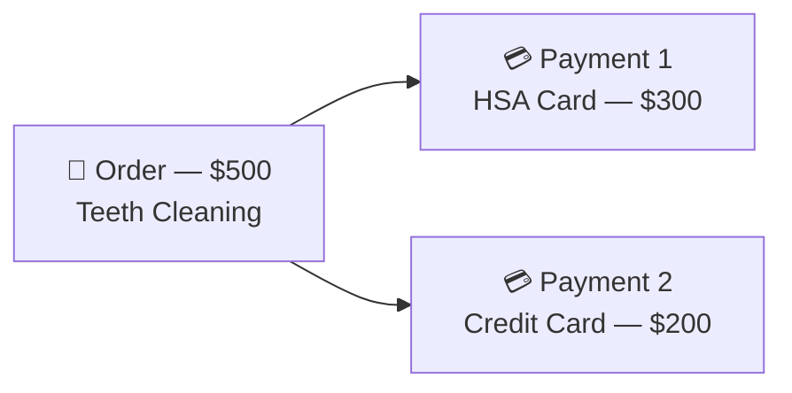
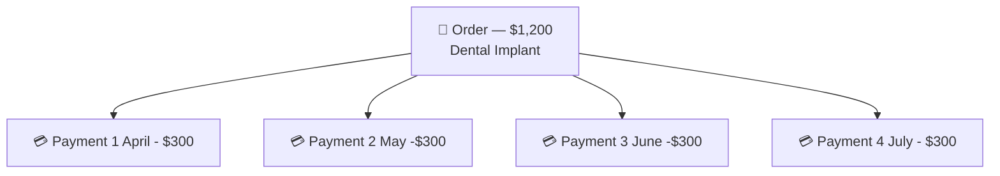

At it's core, an Order is just a way to organize and manage payments. You can set due dates, schedule recurring payments, or send an invoice directly to customers. An order can be used for something as simple as splitting a single charge into multiple payment methods (e.g. splitting a bill between two cards) or as complex as a payment plan with autopay. In any case, the goal is the same, provide an interface that you can "set and forget." You specify the parameters for the order, and we'll handle the rest.





## Order basics

An order is a record that links one or more payments to a product or service. At its simplest, all you need is an `amount` and a `description` and you're good to go. From there, you can attach payments to the order via the API (by setting the `orderId` field on a payment request) or send your customer a link to the order's invoice page where they can pay directly.

### Creating an order

Use the create-or-update endpoint to create an order:

```
POST /n1/merchant/{merchantId}/order/{orderId?}
```

The `orderId` in the URL is optional. Provide your own ID (like an internal invoice number) or omit it to let the API generate one automatically. This endpoint is an **upsert** — if an order with that ID already exists, it will be updated instead.

```json
{
  "description": "Teeth cleaning - June 2026",
  "amount": 250.00
}
```

**Response** `201 Created`:

```json
{
  "success": true,
  "statusCode": 201,
  "data": {
      "id": "YXFS-VX62",
      "merchantId": "Z70B874W63DW",
      "description": "Teeth cleaning - June 2026",
      "amount": 250,
      "remainingBalance": 250,
      "currency": "USD",
      "type": "UNSCHEDULED",
      "status": "PENDING",
      "customers": [],
      "payments": [],
      "invoiceEmailSends": [],
      "invoiceSmsSends": [],
      "creationTime": "2026-04-08T04:32:40.000+00:00",
      "lastUpdatedTime": "2026-04-08T04:32:40.000+00:00",
      "invoiceUrl": "https://prahsys-gateway.test/order/019d6b5d-2986-73ec-82af-de515daa76ee/invoice?expires=1780806760&signature=..."
    }
}
```

### Collecting payment

There are two ways to collect payment on an order:

* **Via the API** — when creating a payment, set the `orderId` field in the payment request body to associate it with the order. The order's `remainingBalance` and `status` update automatically as payments are captured. For transactions (like the <Anchor label="pay transaction" target="_blank" href="doc:transactions#pay">pay transaction</Anchor> ) you can set the `payment.orderId` field to link the payment to the order.
* **Via the invoice page** — every order response includes an `invoiceUrl` (see below). Send this link to your customer and they can make payments directly through the hosted invoice page.

## View and send invoice links

Every order has a hosted invoice page where customers can view what they owe and make payments. The `invoiceUrl` is included in every order response body.

> ⚠️ Unique signatures
>
> The invoice URL contains a unique signature that is regenerated each time you retrieve the order. Don't store these URLs long-term — fetch a fresh one from the API when you need it.

### Sending invoices

Use the send endpoint to deliver the invoice link via email or SMS:

```
POST /n1/merchant/{merchantId}/order/{orderId}/send
```

**Method 1: Send to customers on the order.** Use the boolean flags to send to all emails or phone numbers of customers attached to the order:

```json
{
  "sendToCustomerEmails": true,
  "sendToCustomerPhones": false
}
```

**Method 2: Send to specific addresses.** Provide your own list of recipients. When you provide `emails`, the `sendToCustomerEmails` flag is ignored (same for `phoneNumbers` and `sendToCustomerPhones`):

```json
{
  "emails": ["billing@example.com", "jane@example.com"],
  "phoneNumbers": ["+15551234567"]
}
```

## Attaching customers

You can attach one or more customers to an order by including a `customers` array when creating or updating the order:

```json
{
  "description": "Teeth cleaning - June 2026",
  "amount": 250.00,
  "customers": [
    {
      "firstName": "Jane",
      "lastName": "Smith",
      "email": "jane@example.com",
      "phone": "+15551234567"
    }
  ]
}
```

Attaching customers helps with your own record keeping, but it also sets the contacts for the order. When you send invoices using the boolean flags (`sendToCustomerEmails`, `sendToCustomerPhones`), these are the recipients. Customers can also receive email and SMS notifications for pay schedule reminders, past due notices, and receipts.

## Setting a due date

You can set a `dueDate` on an order to indicate when payment is expected. Once the due date passes and the order still has an outstanding balance, the order status changes to `PAST_DUE`.

```json
{
  "description": "Teeth cleaning - June 2026",
  "amount": 250.00,
  "dueDate": "2026-06-15",
  "customers": [
    {
      "email": "jane@example.com",
      "firstName": "Jane",
      "lastName": "Smith"
    }
  ]
}
```

> ⚠️ Heads up
>
> `dueDate` is only for orders **without** a pay schedule. If you add a `paySchedule`, the schedule manages its own due dates automatically. The two fields are mutually exclusive.

## Updating an order

There are two ways to update an order:

**Option 1: Use the upsert endpoint (POST).** This is the same endpoint used to create an order. If you pass an existing `orderId`, the order is updated with the fields you provide:

```
POST /n1/merchant/{merchantId}/order/{orderId}
```

**Option 2: Use the dedicated update endpoint (PUT).** This is a partial update — only the fields you include in the request body are changed. Everything else stays the same:

```
PUT /n1/merchant/{merchantId}/order/{orderId}
```

```json
{
  "description": "Teeth cleaning - updated description",
  "amount": 300.00
}
```

**Response** `200 OK`:

The response contains the full order object with the updated fields.

### Updatable fields

| Field         | Description                                                                |
| ------------- | -------------------------------------------------------------------------- |
| `description` | Order description                                                          |
| `amount`      | Total order amount                                                         |
| `currency`    | Currency code (ISO 4217)                                                   |
| `dueDate`     | Due date (unscheduled orders only)                                         |
| `customers`   | Customer list — replaces the existing list                                 |
| `paySchedule` | Pay schedule configuration — updates individual fields within the schedule |

> 📘 Updating customers
>
> The `customers` array is additive — new customers are attached to the order, but existing customers are not removed.

## Webhooks

Order status change webhooks let you react in real time when an order's status transitions — for example, from `PENDING` to `PARTIALLY_PAID` or from `PARTIALLY_PAID` to `PAID`. This applies to **all** orders, not just those with pay schedules.

| Event type              | Fires when                                                                     |
| ----------------------- | ------------------------------------------------------------------------------ |
| `orders.status_changed` | The order's status transitions to a different value (e.g., `PENDING` → `PAID`) |

The webhook payload includes the full order object plus the previous and new status values:

```json
{
  "eventType": "orders.status_changed",
  "payload": {
    "data": { /* full order object */ },
    "previousStatus": "PENDING",
    "newStatus": "PARTIALLY_PAID"
  }
}
```

> 📘 Pay schedule webhooks
>
> Orders with pay schedules have additional webhook events for schedule lifecycle changes. See the [Pay Schedules — Webhooks](pay-schedules#webhooks) section for details.

## Pay schedules

You can add a `paySchedule` to an order to turn it into a recurring billing arrangement — either a **payment plan** (fixed total, payments until paid off) or a **subscription** (no total, recurring indefinitely).

> 📘 Next steps
>
> See the [Pay Schedules](pay-schedules) guide for full details on creating subscriptions and payment plans, setting up autopay, starting and cancelling schedules.