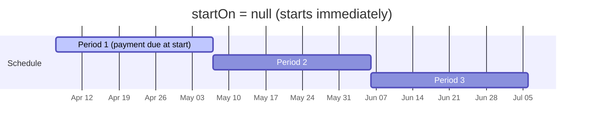
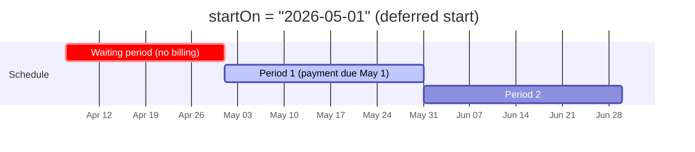
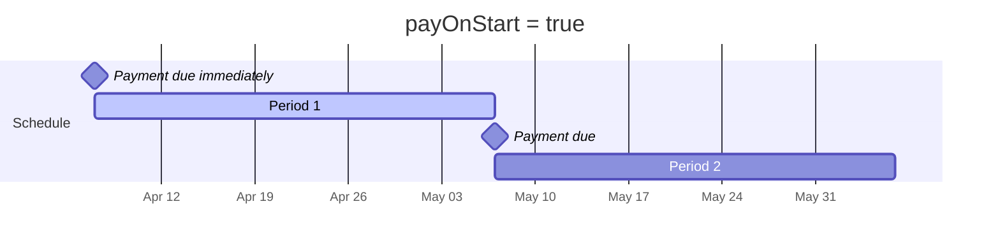
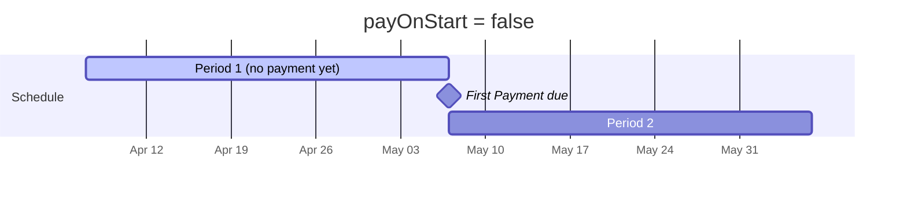
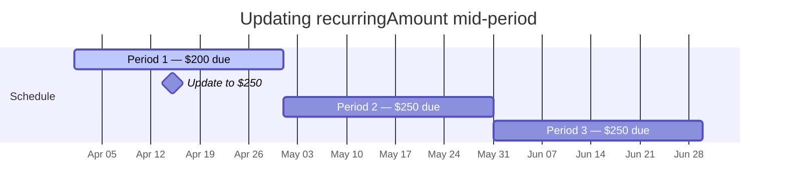

A pay schedule turns an order into a recurring billing arrangement. There are two kinds, and the API determines which one based on whether the order has an `amount`:

* **Payment plan** — the order has a total `amount`. Payments recur until the balance is paid in full. A fixed minimum (`recurringAmount`) is due each period, but the customer can make extra payments to pay it off early. Once `remainingBalance` hits zero, the order moves to `PAID` and the schedule automatically deactivates.

  _Example: A patient owes $1,200 for dental work and pays $200/month over 6 months._

* **Subscription** — the order has **no** `amount` (null or omitted). A fixed `recurringAmount` is charged each period indefinitely until you cancel the schedule. Extra payments are not allowed.

  _Example: A gym charges $49.99/month for a membership with no end date._

### Required fields

When adding a `paySchedule` to an order, two fields are required:

* `recurringAmount` — the amount due each period
* `frequency` — how often a payment is due: `DAILY`, `WEEKLY`, `BI_WEEKLY`, `MONTHLY`, or `YEARLY`

### Optional fields

| Field                   | Type    | Default             | Description                                                                                                                                                                                                                                                            |
| ----------------------- | ------- | ------------------- | ---------------------------------------------------------------------------------------------------------------------------------------------------------------------------------------------------------------------------------------------------------------------- |
| `autopay`               | boolean | `false`             | Automatically charge the stored billing method each period. See [Setting up autopay](#setting-up-autopay).                                                                                                                                                             |
| `billing`               | object  | `null`              | Payment method for autopay. Must contain a `token` (pay token). This field is optional when creating the order. There are several ways to add a billing method, but it must be present before [starting a schedule](#starting-a-pay-schedule) without autopay enabled. |
| `sendEmail`             | boolean | `true`              | Send email notifications (reminders, invoices, receipts) to attached customers.                                                                                                                                                                                        |
| `sendSms`               | boolean | `false`             | Send SMS notifications to attached customers.                                                                                                                                                                                                                          |
| `reminderBeforeDueDays` | int[]   | Varies by frequency | Days before the next due date to send payment reminders.                                                                                                                                                                                                               |
| `retryAfterDueDays`     | int[]   | Varies by frequency | Days after the due date to retry failed autopay charges or send past due reminders.                                                                                                                                                                                    |

**Default reminder and retry days by frequency:**

| Frequency   | Reminder days (before due) | Retry days (after due) |
| ----------- | -------------------------- | ---------------------- |
| `DAILY`     | None                       | None                   |
| `WEEKLY`    | 3                          | 1, 3                   |
| `BI_WEEKLY` | 5                          | 1, 3, 7                |
| `MONTHLY`   | 7, 3                       | 1, 3, 7                |
| `YEARLY`    | 30, 7, 3                   | 1, 7, 30               |

You can override these defaults by passing your own arrays. For example, to send reminders 10 and 5 days before each due date:

```json
{
  "paySchedule": {
    "recurringAmount": 200.00,
    "frequency": "MONTHLY",
    "reminderBeforeDueDays": [10, 5]
  }
}
```

### Payment plan example

```json
{
  "description": "Dental implant - payment plan",
  "amount": 1200.00,
  "customers": [
    {
      "firstName": "Maria",
      "lastName": "Gonzalez",
      "email": "maria@example.com"
    }
  ],
  "paySchedule": {
    "recurringAmount": 200.00,
    "frequency": "MONTHLY"
  }
}
```

The response will have `"type": "PAYMENT_PLAN"` because both `amount` and `paySchedule` are present.

### Subscription example

```json
{
  "description": "Monthly gym membership",
  "customers": [
    {
      "firstName": "Alex",
      "lastName": "Chen",
      "email": "alex@example.com"
    }
  ],
  "paySchedule": {
    "recurringAmount": 49.99,
    "frequency": "MONTHLY"
  }
}
```

The response will have `"type": "SUBSCRIPTION"` because `amount` is omitted and `paySchedule` is present.

### Two-step activation

> ❗ Important
>
> Creating an order with a `paySchedule` does **not** start billing. The schedule remains inactive (`"isActive": false`) until you explicitly start it. See [Starting a pay schedule](#starting-a-pay-schedule) below.

## Setting up autopay

Autopay means the system automatically charges the customer's stored payment method on each due date. If a charge fails, it retries on the days you configure with `retryAfterDueDays`.

<Callout icon="📘" theme="info">
  Autopay is deactivated by default to avoid unexpected charges. However, for classic subscriptions or payment plans, using autopay provides the most reliable experience and insures that your merchant gets paid on time.
</Callout>

### Requirements

To use autopay, you need a **pay token** attached to the pay schedule's billing. A pay token is a tokenized payment method that can be charged repeatedly (see <Anchor label="tokenization" target="_blank" href="doc:tokenization">tokenization</Anchor>) . You can attach one in two ways:

**Option 1: Set the token directly.** If you already have a pay token, pass it in the `paySchedule.billing.token` field when creating or updating the order:

```json
{
  "description": "Monthly gym membership",
  "paySchedule": {
    "recurringAmount": 49.99,
    "frequency": "MONTHLY",
    "autopay": true,
    "billing": {
      "token": "pt_abc123def456"
    }
  }
}
```

**Option 2: Provide a session when starting.** If you're using Prahsys session iframes to collect card details (see <Anchor label="Pay Session" target="_blank" href="doc:pay-session">Pay Session</Anchor> ), you can pass a `session.id` in the start request instead (see [start endpoint](#start-endpoint) ). The system will automatically pull the card info from the session and tokenize it at the time of starting. The session iframes must contain the required card fields for tokenization.

## How a pay schedule works without autopay

If autopay is not enabled, the schedule doesn't charge the customer automatically. Instead, each period the system:

1. Checks whether the customer has made a payment on the order
2. Sends email reminders before the due date (configurable via `reminderBeforeDueDays`)
3. Sends an invoice at the start of each new period
4. Marks the order as past due if the customer misses a pay period

The customer pays manually — either through the invoice page or through a payment you process via the API.

## Starting a pay schedule

There are two ways to start a pay schedule:

* **Manually via the API** — call the start endpoint yourself (described below)
* **Let the customer start it** — send the order invoice. If the order has an inactive pay schedule, the invoice page gives the customer the option to add a billing method and make the first payment, which will automatically start the subscription or payment plan.

### Start endpoint

```
POST /n1/merchant/{merchantId}/order/{orderId}/pay-schedule/start
```

```json
{
  "payOnStart": true
}
```

If autopay is enabled, a pay token must be attached to the pay schedule's billing before this endpoint is called. Alternatively, provide a `session.id` in the request body and the card will be tokenized automatically (see <Anchor label="Pay Session" target="_blank" href="doc:pay-session">Pay Session</Anchor> ):

```json
{
  "payOnStart": true,
  "session": {
    "id": "ses_abc123def456"
  }
}
```

### The `startOn` parameter

Use `startOn` to defer the start of the schedule to a future date. This is useful when a customer signs up today but their first billing period shouldn't begin until later — for example, a gym membership that starts on the first of next month.

```json
{
  "payOnStart": true,
  "startOn": "2026-05-01"
}
```





When `startOn` is set, no payment is processed immediately regardless of other parameters. An invoice is sent to the customer instead, and the first payment is due on the `startOn` date (if `payOnStart` is true) or one period after (if `payOnStart` is false).

### The `payOnStart` parameter

`payOnStart` controls whether a payment is due at the **beginning** or **end** of the first period.





* **`payOnStart: true`** — a payment is processed immediately (or due on the `startOn` date if set). This requires either a `billing.token` on the pay schedule or a `session.id` in the request (if not using `startOn`). If autopay is not enabled and you're using `startOn`, then no payment method is required. We'll just check that a payment is made at that future start date and mark the order as past due if not.
* **`payOnStart: false`** — no payment is made at the start. The first payment is due one full period later. An invoice is sent to the customer immediately (if `sendSms` and/or `sendEmail` is enabled).

## Updating an active pay schedule

You can update a pay schedule while it's active — no need to cancel and recreate it. Use the [update order](orders#updating-an-order) endpoints (POST upsert or PUT) and include the `paySchedule` fields you want to change. For example, to change the recurring amount:

```json
{
  "paySchedule": {
    "recurringAmount": 250.00
  }
}
```

Changes take effect on the **next** billing period. The current period is unaffected.



This works for any updatable pay schedule field — `recurringAmount`, `frequency`, `autopay`, `billing`, `sendEmail`, `sendSms`, `reminderBeforeDueDays`, and `retryAfterDueDays`.

## Cancelling a pay schedule

```
POST /n1/merchant/{merchantId}/order/{orderId}/pay-schedule/cancel
```

Cancelling a pay schedule deactivates it immediately. The `paySchedule.isActive` field will be set to `false`. All upcoming due dates and scheduled reminders are cleared, and a cancellation email is sent to the customer.

> ⚠️ Restrictions
>
> * The pay schedule must be active to cancel it.
> * You cannot cancel a pay schedule that has an outstanding past due balance. The customer must pay what they owe for past periods before the schedule can be cancelled.

## Webhooks

Pay schedule webhooks notify you of key lifecycle events so you can keep your systems in sync. These fire for any order that has a pay schedule attached (both payment plans and subscriptions).

| Event type                             | Fires when                                                                                                     | Extra payload fields               |
| -------------------------------------- | -------------------------------------------------------------------------------------------------------------- | ---------------------------------- |
| `orders.pay_schedule.started`          | A pay schedule is activated (via the API or the invoice page)                                                  | —                                  |
| `orders.pay_schedule.cancelled`        | A pay schedule is cancelled                                                                                    | —                                  |
| `orders.pay_schedule.period.fulfilled` | A billing period has been fully paid                                                                           | `periodStartDate`, `periodEndDate` |
| `orders.pay_schedule.autopay.failed`   | An automatic payment attempt fails                                                                             | —                                  |
| `orders.status_changed`                | The order's status transitions (e.g., `PENDING` → `PARTIALLY_PAID`). See [Orders — Webhooks](orders#webhooks). | `previousStatus`, `newStatus`      |

All pay schedule webhook payloads include the full order object (including the pay schedule and payment history) under `payload.data`:

```json
{
  "eventType": "orders.pay_schedule.started",
  "payload": {
    "data": { /* full order object */ }
  }
}
```

The `orders.pay_schedule.period.fulfilled` webhook fires once a billing period is fulfilled and includes the period's date range:

```json
{
  "eventType": "orders.pay_schedule.period.fulfilled",
  "payload": {
    "data": { /* full order object */ },
    "periodStartDate": "2026-04-01",
    "periodEndDate": "2026-04-30"
  }
}
```
