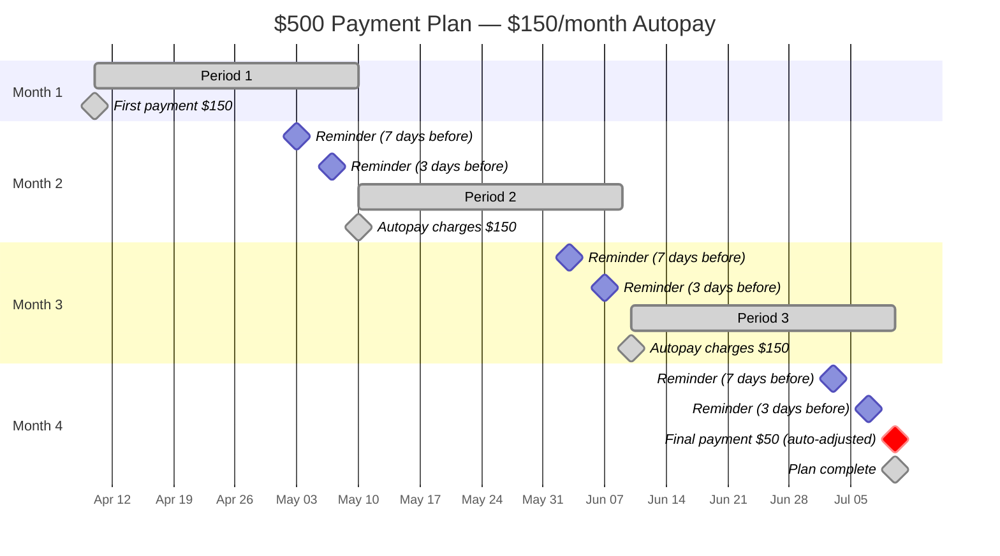
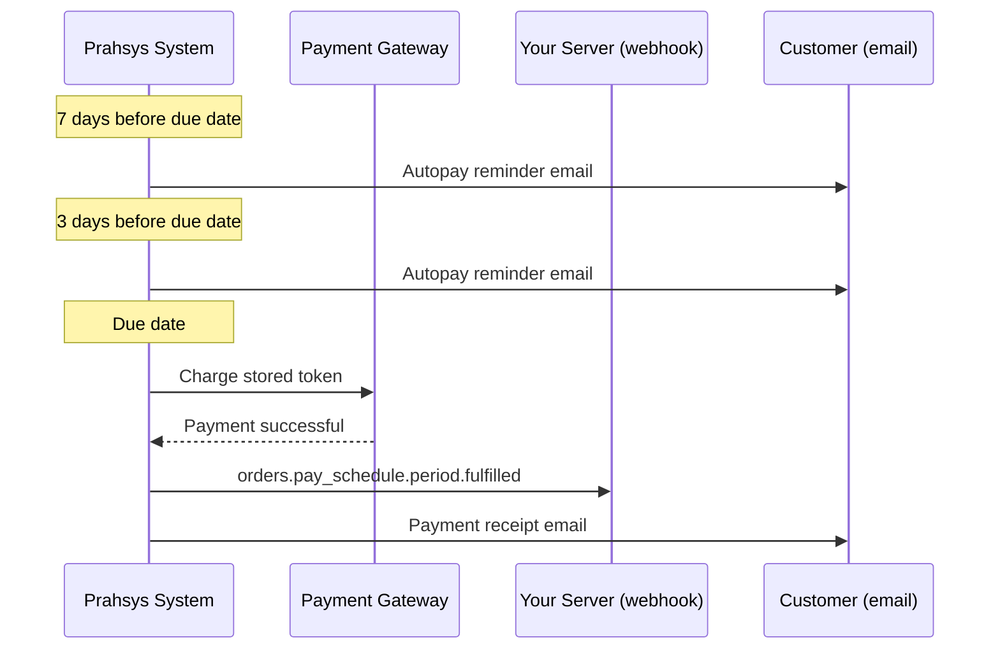
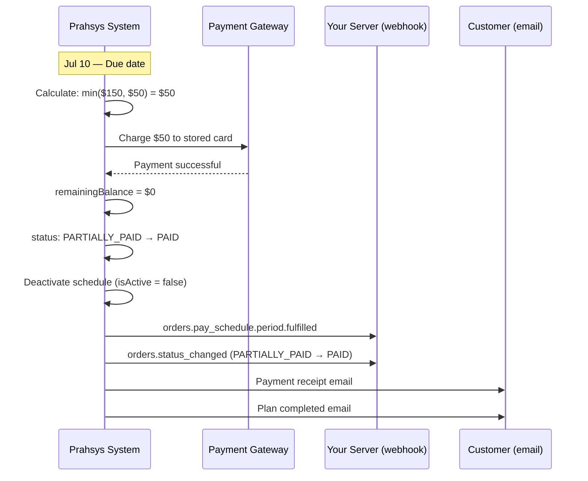
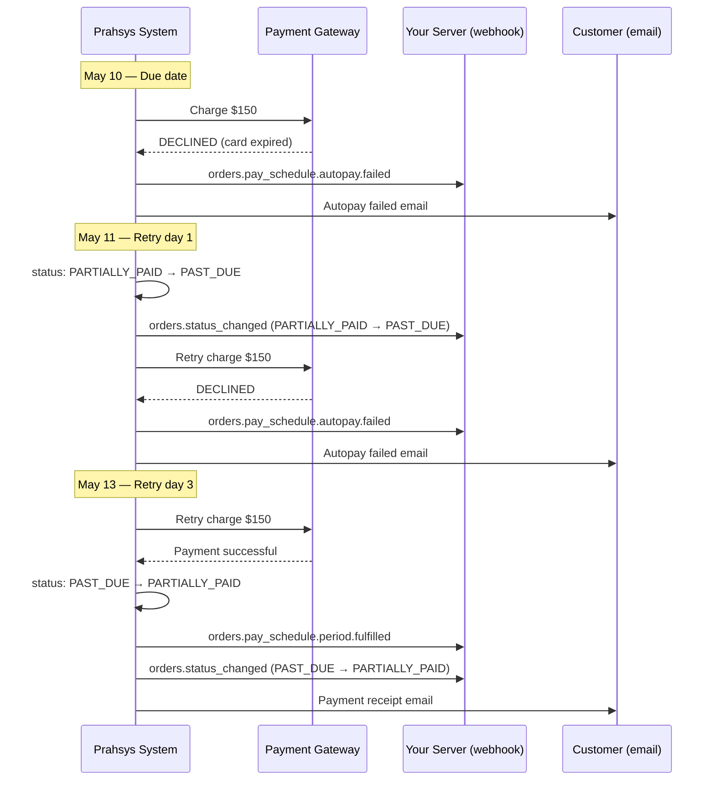

This guide walks through a complete payment plan with autopay — from creating a $500 order to the final payment. You'll see every API call, webhook, and email along the way.

> 📘 Prerequisites
>
> This builds on concepts from [Orders](orders) and [Pay Schedules](pay-schedules). Read those first if you haven't already.

## The scenario

Maria Gonzalez owes $500 for orthodontic treatment. She'll pay $150/month with autopay. The system handles everything automatically — reminders, charges, and receipts:

* **Month 1 (Apr 10):** $150 charged at start
* **Month 2 (May 10):** $150 autopay
* **Month 3 (Jun 10):** $150 autopay
* **Month 4 (Jul 10):** $50 autopay (auto-adjusted — only the remaining balance is charged)

## 1. Create the order

Create an order with a pay schedule that charges $150/month with autopay enabled.

```
POST /n1/merchant/{merchantId}/order/{orderId?}
```

```json
{
  "description": "Orthodontic treatment - payment plan",
  "amount": 500.00,
  "customers": [
    {
      "firstName": "Maria",
      "lastName": "Gonzalez",
      "email": "maria@example.com"
    }
  ],
  "paySchedule": {
    "recurringAmount": 150.00,
    "frequency": "MONTHLY",
    "autopay": true
  }
}
```

**Response** `201 Created`:

```json
{
  "success": true,
  "statusCode": 201,
  "data": {
    "id": "A3K7-NP2W",
    "merchantId": "Z70B874W63DW",
    "description": "Orthodontic treatment - payment plan",
    "amount": 500.00,
    "remainingBalance": 500.00,
    "currency": "USD",
    "type": "PAYMENT_PLAN",
    "status": "PENDING",
    "paySchedule": {
      "recurringAmount": 150.00,
      "currency": "USD",
      "frequency": "MONTHLY",
      "isActive": false,
      "autopay": true,
      "reminderBeforeDueDays": [7, 3],
      "retryAfterDueDays": [1, 3, 7],
      "sendSms": false,
      "sendEmail": true
    },
    "customers": [
      {
        "firstName": "Maria",
        "lastName": "Gonzalez",
        "email": "maria@example.com",
        "creationTime": "2026-04-10T12:00:00.000+00:00",
        "lastUpdatedTime": "2026-04-10T12:00:00.000+00:00"
      }
    ],
    "payments": [],
    "invoiceEmailSends": [],
    "invoiceSmsSends": [],
    "creationTime": "2026-04-10T12:00:00.000+00:00",
    "lastUpdatedTime": "2026-04-10T12:00:00.000+00:00",
    "invoiceUrl": "https://gateway.prahsys.com/order/019d7a00-0000-7000-8000-000000000001/pay-schedule/invoice?expires=1783886400&signature=a1b2c3d4..."
  }
}
```

A few things to note:

* `type` is `PAYMENT_PLAN` because both `amount` and `paySchedule` are present.
* `isActive` is `false` — **creating the order does not start billing.** The schedule stays inactive until you explicitly start it.
* Default `reminderBeforeDueDays` and `retryAfterDueDays` for `MONTHLY` frequency were applied automatically.

## 2. Start the plan

There are two ways to kick things off. Pick whichever fits your integration.

### Option A: Customer starts via the invoice page

Send the invoice and let the customer handle the rest.

**Step 1: Send the invoice.**

```
POST /n1/merchant/{merchantId}/order/A3K7-NP2W/send
```

```json
{
  "sendToCustomerEmails": true
}
```

**Step 2: Customer receives the email.** Maria gets a welcome email with a link to the invoice page. <Anchor label="Preview the welcome email." target="_blank" href="https://gateway.prahsys.com/test/emails/pay-schedule-welcome?orderType=PAYMENT_PLAN&autopay=true">Preview the welcome email.</Anchor>

> 📘 Direct link
>
> You don't have to send the email through our API. The `invoiceUrl` in the order response points to the same invoice page — you can give that URL to the customer directly, or link to it from your own app.

**Step 3: Customer completes setup.** On the invoice page, Maria adds her card (which gets tokenized automatically) and makes the first $150 payment. This activates the schedule and the same webhooks and emails are sent as in Option B below.

### Option B: Merchant starts via the API

**Step 1: Attach a billing token.** If you already have a pay token from <Anchor label="tokenization" target="_blank" href="doc:tokenization">tokenization</Anchor>, attach it to the pay schedule:

```
PUT /n1/merchant/{merchantId}/order/A3K7-NP2W
```

```json
{
  "paySchedule": {
    "billing": {
      "token": "tok_mG7kP2xR9vNq4242"
    }
  }
}
```

> 📘 Using a session instead
>
> You can skip this step and provide a `session.id` in the start request instead. The system will tokenize the session's payment method automatically. See the <Anchor label="Pay Session" target="_blank" href="doc:pay-session">Pay Session</Anchor> docs for details.

**Step 2: Start the schedule.**

```
POST /n1/merchant/{merchantId}/order/A3K7-NP2W/pay-schedule/start
```

```json
{
  "payOnStart": true
}
```

With `payOnStart: true`, the first $150 is charged immediately.

**Response** `201 Created`:

```json
{
  "success": true,
  "statusCode": 201,
  "message": "Pay schedule started successfully. First payment has been processed.",
  "data": {
    "id": "A3K7-NP2W",
    "merchantId": "Z70B874W63DW",
    "description": "Orthodontic treatment - payment plan",
    "amount": 500.00,
    "remainingBalance": 350.00,
    "currency": "USD",
    "type": "PAYMENT_PLAN",
    "status": "PARTIALLY_PAID",
    "paySchedule": {
      "recurringAmount": 150.00,
      "currency": "USD",
      "frequency": "MONTHLY",
      "isActive": true,
      "autopay": true,
      "startDate": "2026-04-10",
      "currentDueDate": "2026-05-10",
      "nextReminderDate": "2026-05-03",
      "billing": {
        "card": { "numberMasked": "xxxxxxxxxxxx4242" },
        "token": "tok_mG7kP2xR9vNq4242",
        "method": "CARD"
      },
      "reminderBeforeDueDays": [7, 3],
      "retryAfterDueDays": [1, 3, 7],
      "sendSms": false,
      "sendEmail": true
    },
    "customers": [
      {
        "firstName": "Maria",
        "lastName": "Gonzalez",
        "email": "maria@example.com",
        "creationTime": "2026-04-10T12:00:00.000+00:00",
        "lastUpdatedTime": "2026-04-10T12:00:00.000+00:00"
      }
    ],
    "payments": [
      {
        "id": "AUTOPAY-Z70B874W63DW-a1b2c3d4e5f6",
        "merchantId": "Z70B874W63DW",
        "orderId": "A3K7-NP2W",
        "amount": 150.00,
        "currency": "USD",
        "description": "Autopay payment for order A3K7-NP2W",
        "status": "CAPTURED",
        "billing": {
          "card": { "numberMasked": "xxxxxxxxxxxx4242" },
          "token": "tok_mG7kP2xR9vNq4242",
          "method": "CARD"
        },
        "creationTime": "2026-04-10T12:02:00.000+00:00",
        "lastUpdatedTime": "2026-04-10T12:02:00.000+00:00"
      }
    ],
    "invoiceEmailSends": [],
    "invoiceSmsSends": [],
    "creationTime": "2026-04-10T12:00:00.000+00:00",
    "lastUpdatedTime": "2026-04-10T12:02:00.000+00:00",
    "invoiceUrl": "https://gateway.prahsys.com/order/019d7a00-0000-7000-8000-000000000001/pay-schedule/invoice?expires=1783886400&signature=a1b2c3d4..."
  }
}
```

**Step 3: Two webhooks fire.**

`orders.pay_schedule.started` — the schedule is now active:

```json
{
  "eventType": "orders.pay_schedule.started",
  "payload": {
    "data": {
      "id": "A3K7-NP2W",
      "type": "PAYMENT_PLAN",
      "status": "PARTIALLY_PAID",
      "amount": 500.00,
      "remainingBalance": 350.00,
      "paySchedule": {
        "isActive": true,
        "startDate": "2026-04-10",
        "currentDueDate": "2026-05-10"
        /* ...full pay schedule object */
      }
      /* ...full order object */
    }
  }
}
```

`orders.status_changed` — the order moved from `PENDING` to `PARTIALLY_PAID`:

```json
{
  "eventType": "orders.status_changed",
  "payload": {
    "data": { /* full order object */ },
    "previousStatus": "PENDING",
    "newStatus": "PARTIALLY_PAID"
  }
}
```

**Step 4: "Started" email sent to Maria.** <Anchor label="Preview the started email." target="_blank" href="https://gateway.prahsys.com/test/emails/pay-schedule-started?orderType=PAYMENT_PLAN&autopay=true&payOnStart=true">Preview the started email.</Anchor>

## 3. What happens each month

With the plan started and autopay enabled, everything runs on autopilot. Here's the full timeline:



### The monthly cycle

Each billing period follows the same pattern:



* **7 days before due:** Autopay reminder email. <Anchor label="Preview." target="_blank" href="https://gateway.prahsys.com/test/emails/autopay-reminder?orderType=PAYMENT_PLAN">Preview.</Anchor>
* **3 days before due:** Second reminder email.
* **On the due date:** Autopay charges the stored card. The `orders.pay_schedule.period.fulfilled` webhook fires and a payment receipt is emailed to Maria.

> 📘 Configurable reminders
>
> The 7-day and 3-day reminders are the `MONTHLY` defaults. You can customize the schedule by setting `reminderBeforeDueDays` when creating or updating the pay schedule — for example, `[10, 5, 1]` to send reminders 10, 5, and 1 day before each due date.

### Running balance

| Month | Date   | Charged | Remaining Balance | Status           | Webhooks Fired                                  |
| ----- | ------ | ------- | ----------------- | ---------------- | ----------------------------------------------- |
| 1     | Apr 10 | $150.00 | $350.00           | `PARTIALLY_PAID` | `started`, `period.fulfilled`, `status_changed` |
| 2     | May 10 | $150.00 | $200.00           | `PARTIALLY_PAID` | `period.fulfilled`                              |
| 3     | Jun 10 | $150.00 | $50.00            | `PARTIALLY_PAID` | `period.fulfilled`                              |
| 4     | Jul 10 | $50.00  | $0.00             | `PAID`           | `period.fulfilled`, `status_changed`            |

> 📘 Status change webhooks
>
> The `orders.status_changed` webhook only fires when the status actually transitions. Month 1 triggers it (`PENDING` → `PARTIALLY_PAID`) and Month 4 triggers it (`PARTIALLY_PAID` → `PAID`). Months 2 and 3 stay at `PARTIALLY_PAID`, so no status webhook fires.

## 4. Final payment (auto-adjusted)

On July 10, only $50 remains — less than the $150 recurring amount. The system automatically adjusts the charge to the remaining balance. No configuration needed.

The formula: `min(recurringAmount, remainingBalance)` = `min($150, $50)` = **$50**.



Two webhooks fire for the final payment:

`orders.pay_schedule.period.fulfilled`:

```json
{
  "eventType": "orders.pay_schedule.period.fulfilled",
  "payload": {
    "data": {
      "id": "A3K7-NP2W",
      "status": "PAID",
      "remainingBalance": 0,
      "paySchedule": { "isActive": false }
      /* ...full order object */
    },
    "periodStartDate": "2026-07-10",
    "periodEndDate": "2026-08-09"
  }
}
```

`orders.status_changed`:

```json
{
  "eventType": "orders.status_changed",
  "payload": {
    "data": { /* full order object — status: "PAID", remainingBalance: 0 */ },
    "previousStatus": "PARTIALLY_PAID",
    "newStatus": "PAID"
  }
}
```

Maria receives a payment receipt and a plan completed email. <Anchor label="Preview the completed email." target="_blank" href="https://gateway.prahsys.com/test/emails/pay-schedule-completed?orderType=PAYMENT_PLAN">Preview the completed email.</Anchor>

> 📘 No need to cancel
>
> When a payment plan is fully paid, the schedule deactivates automatically (`isActive` becomes `false`). You don't need to call the cancel endpoint.

## 5. What if autopay fails?

If the stored card is declined on a due date, the system retries automatically on the days configured in `retryAfterDueDays`. For `MONTHLY`, the default is days 1, 3, and 7 after the due date. The day after the due date, the order status changes to `PAST_DUE`.



Each failed attempt fires an `orders.pay_schedule.autopay.failed` webhook and sends a failure email to the customer. The email includes a link to the invoice page where they can update their payment method. <Anchor label="Preview the autopay failed email." target="_blank" href="https://gateway.prahsys.com/test/emails/autopay-failed?orderType=PAYMENT_PLAN">Preview the autopay failed email.</Anchor>

> ⚠️ After all retries are exhausted
>
> If all retry attempts fail (days 1, 3, and 7 for MONTHLY), the schedule stays active and advances to the next period. The customer still owes for the missed period — the past due amount rolls into the next charge. They can also pay manually through the invoice page at any time.

## Email reference

| When                                    | Email            | Preview                                                                                                                                                                          |
| --------------------------------------- | ---------------- | -------------------------------------------------------------------------------------------------------------------------------------------------------------------------------- |
| Invoice sent (schedule not yet started) | Welcome          | <Anchor label="Preview" target="_blank" href="https://gateway.prahsys.com/test/emails/pay-schedule-welcome?orderType=PAYMENT_PLAN&autopay=true">Preview</Anchor>                 |
| Schedule started                        | Started          | <Anchor label="Preview" target="_blank" href="https://gateway.prahsys.com/test/emails/pay-schedule-started?orderType=PAYMENT_PLAN&autopay=true&payOnStart=true">Preview</Anchor> |
| Before due date (7 and 3 days)          | Autopay reminder | <Anchor label="Preview" target="_blank" href="https://gateway.prahsys.com/test/emails/autopay-reminder?orderType=PAYMENT_PLAN">Preview</Anchor>                                  |
| After successful charge                 | Payment receipt  | —                                                                                                                                                                                |
| Autopay charge fails                    | Autopay failed   | <Anchor label="Preview" target="_blank" href="https://gateway.prahsys.com/test/emails/autopay-failed?orderType=PAYMENT_PLAN">Preview</Anchor>                                    |
| Plan fully paid                         | Completed        | <Anchor label="Preview" target="_blank" href="https://gateway.prahsys.com/test/emails/pay-schedule-completed?orderType=PAYMENT_PLAN">Preview</Anchor>                            |
| Schedule cancelled                      | Cancelled        | <Anchor label="Preview" target="_blank" href="https://gateway.prahsys.com/test/emails/pay-schedule-cancelled?orderType=PAYMENT_PLAN">Preview</Anchor>                            |

## Webhook reference

For the full list of pay schedule webhook events and their payloads, see <Anchor label="Pay Schedules — Webhooks" target="_blank" href="pay-schedules#webhooks">Pay Schedules — Webhooks</Anchor>.