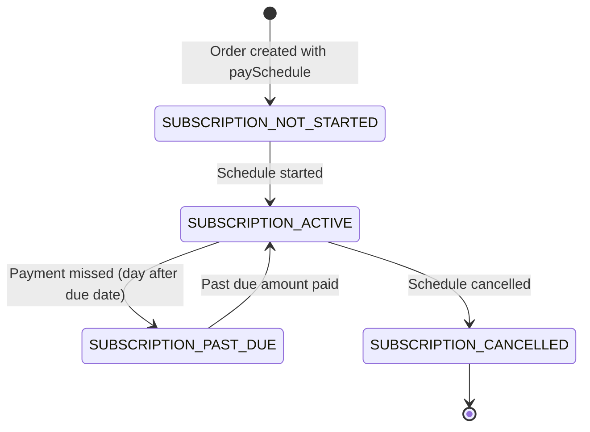
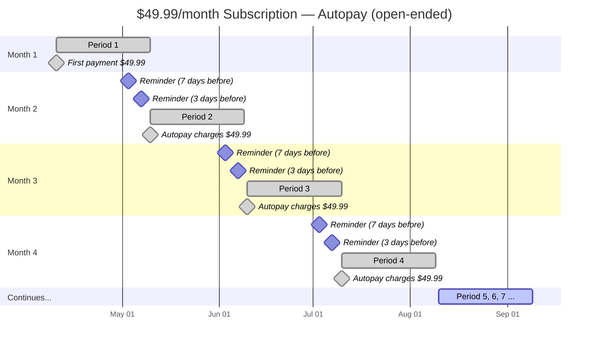
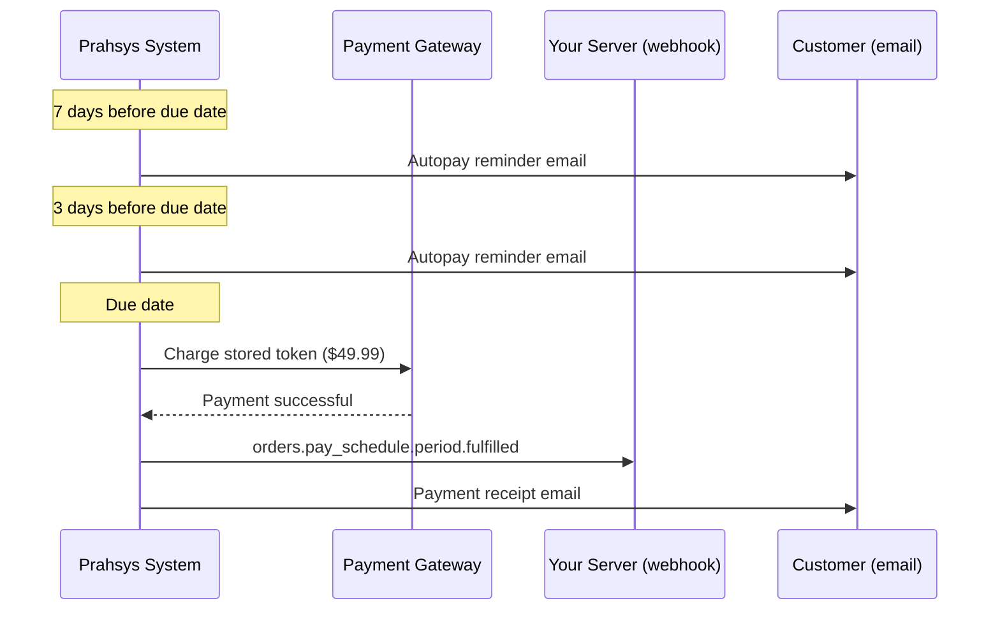
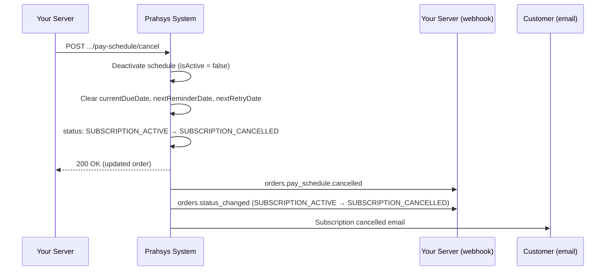
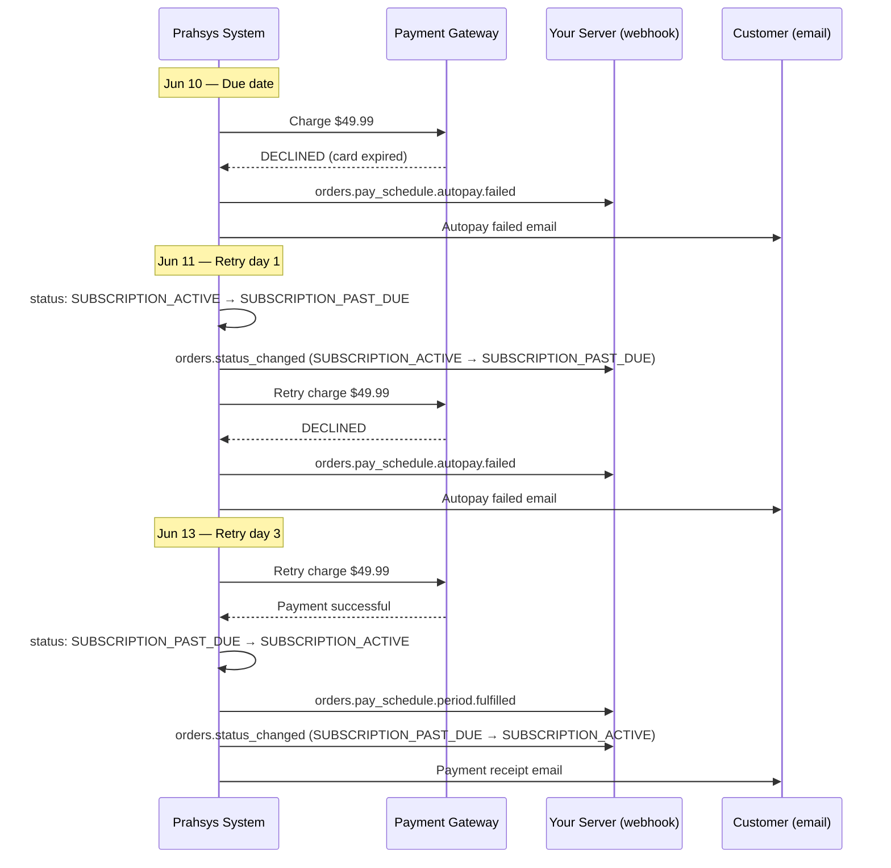

This guide walks through a complete subscription with autopay — from creating an open-ended $49.99/month order to cancellation. You'll see every API call, webhook, and email along the way.

> 📘 Prerequisites
>
> This builds on concepts from [Orders](orders) and [Pay Schedules](pay-schedules). Read those first if you haven't already.

## The scenario

Alex Chen signs up for a $49.99/month gym membership with autopay. There's no end date — the subscription runs indefinitely until cancelled:

* **Month 1 (Apr 10):** $49.99 charged at start
* **Month 2 (May 10):** $49.99 autopay
* **Month 3 (Jun 10):** $49.99 autopay
* **Month 4 (Jul 10):** $49.99 autopay
* **...and so on** until you cancel the subscription

> 📘 Subscriptions vs. payment plans
>
> A subscription has **no** total `amount` — the `recurringAmount` is charged every period indefinitely. A payment plan has a fixed `amount` and ends when the balance reaches zero. See [Pay Schedules](pay-schedules) for more on the difference, or the [comparison table](#subscription-vs-payment-plan--quick-comparison) at the end of this page.

## Subscription status lifecycle

Subscriptions use their own set of statuses, separate from payment plan statuses:



| Status                     | Meaning                                                                     |
| -------------------------- | --------------------------------------------------------------------------- |
| `SUBSCRIPTION_NOT_STARTED` | Order created with a pay schedule, but the schedule hasn't been started yet |
| `SUBSCRIPTION_ACTIVE`      | Schedule is running and all payments are current                            |
| `SUBSCRIPTION_PAST_DUE`    | A billing period was missed — the customer owes for a past period           |
| `SUBSCRIPTION_CANCELLED`   | Schedule was cancelled (either by you or the customer)                      |

> ⚠️ No direct path from past due to cancelled
>
> You cannot cancel a subscription that has an outstanding past due balance. The customer must pay what they owe before the schedule can be cancelled. The path is always `SUBSCRIPTION_PAST_DUE` → `SUBSCRIPTION_ACTIVE` → `SUBSCRIPTION_CANCELLED`.

## 1. Create the order

Create an order with the [Update or Create Order](/reference/updateorcreateorder) endpoint **without** an `amount` field — this tells the API it's a subscription. Include a `paySchedule` with the monthly charge and enable autopay.

```
POST /n1/merchant/{merchantId}/order/{orderId?}
```

```json
{
  "description": "Premium gym membership - monthly",
  "customers": [
    {
      "firstName": "Alex",
      "lastName": "Chen",
      "email": "alex@example.com"
    }
  ],
  "paySchedule": {
    "recurringAmount": 49.99,
    "frequency": "MONTHLY",
    "autopay": true
  }
}
```

**Response** `201 Created`:

```json
{
  "success": true,
  "statusCode": 201,
  "data": {
    "id": "GYM1-AX7K",
    "merchantId": "Z70B874W63DW",
    "description": "Premium gym membership - monthly",
    "currency": "USD",
    "type": "SUBSCRIPTION",
    "status": "SUBSCRIPTION_NOT_STARTED",
    "paySchedule": {
      "recurringAmount": 49.99,
      "currency": "USD",
      "frequency": "MONTHLY",
      "isActive": false,
      "autopay": true,
      "reminderBeforeDueDays": [7, 3],
      "retryAfterDueDays": [1, 3, 7],
      "sendSms": false,
      "sendEmail": true
    },
    "customers": [
      {
        "firstName": "Alex",
        "lastName": "Chen",
        "email": "alex@example.com",
        "creationTime": "2026-04-10T12:00:00.000+00:00",
        "lastUpdatedTime": "2026-04-10T12:00:00.000+00:00"
      }
    ],
    "payments": [],
    "invoiceEmailSends": [],
    "invoiceSmsSends": [],
    "creationTime": "2026-04-10T12:00:00.000+00:00",
    "lastUpdatedTime": "2026-04-10T12:00:00.000+00:00",
    "invoiceUrl": "https://gateway.prahsys.com/order/019d7a00-0000-7000-8000-000000000002/pay-schedule/invoice?expires=1783886400&signature=e5f6a7b8..."
  }
}
```

A few things to note:

* `type` is `SUBSCRIPTION` because `paySchedule` is present but `amount` is omitted.
* There is **no** `amount` or `remainingBalance` field in the response — subscriptions don't have a fixed total.
* `isActive` is `false` — **creating the order does not start billing.** The schedule stays inactive until you explicitly start it.
* Default `reminderBeforeDueDays` and `retryAfterDueDays` for `MONTHLY` frequency were applied automatically.

## 2. Start the subscription

There are two ways to kick things off. Pick whichever fits your integration.

### Option A: Customer starts via the invoice page

Send the invoice and let the customer handle the rest.

**Step 1: Send the invoice.** Use the [Send Order Invoice](/reference/sendorderinvoice) endpoint to email Alex a link to the invoice page.

```
POST /n1/merchant/{merchantId}/order/GYM1-AX7K/send
```

```json
{
  "sendToCustomerEmails": true
}
```

**Step 2: Customer receives the email.** Alex gets a welcome email with a link to the invoice page. <Anchor label="Preview the welcome email." target="_blank" href="https://gateway.prahsys.com/test/emails/pay-schedule-welcome?orderType=SUBSCRIPTION&autopay=true">Preview the welcome email.</Anchor>

> 📘 Direct link
>
> You don't have to send the email with the [Send Order Invoice](/reference/sendorderinvoice) endpoint. The `invoiceUrl` in the order response points to the same invoice page — you can give that URL to the customer directly, or link to it from your own app.

**Step 3: Customer completes setup.** On the invoice page, Alex adds a card (which gets tokenized automatically) and makes the first $49.99 payment. This activates the schedule and the same webhooks and emails are sent as in Option B below.

### Option B: Merchant starts via the API

**Step 1: Attach a billing token.** If you already have a pay token from <Anchor label="tokenization" target="_blank" href="doc:tokenization">tokenization</Anchor>, attach it to the pay schedule with the [Update Order](/reference/updateorder) endpoint:

```
PUT /n1/merchant/{merchantId}/order/GYM1-AX7K
```

```json
{
  "paySchedule": {
    "billing": {
      "token": "tok_mG7kP2xR9vNq4242"
    }
  }
}
```

> 📘 Using a session instead
>
> You can skip this step and provide a `session.id` in the [Start Pay Schedule](/reference/startpayschedule) request instead. The system will tokenize the session's payment method automatically. See the <Anchor label="Pay Session" target="_blank" href="doc:pay-session">Pay Session</Anchor> docs for details.

**Step 2: Start the schedule.** Use the [Start Pay Schedule](/reference/startpayschedule) endpoint to activate the subscription and process the first payment.

```
POST /n1/merchant/{merchantId}/order/GYM1-AX7K/pay-schedule/start
```

```json
{
  "payOnStart": true
}
```

With `payOnStart: true`, the first $49.99 is charged immediately.

**Response** `201 Created`:

```json
{
  "success": true,
  "statusCode": 201,
  "message": "Pay schedule started successfully. First payment has been processed.",
  "data": {
    "id": "GYM1-AX7K",
    "merchantId": "Z70B874W63DW",
    "description": "Premium gym membership - monthly",
    "currency": "USD",
    "type": "SUBSCRIPTION",
    "status": "SUBSCRIPTION_ACTIVE",
    "paySchedule": {
      "recurringAmount": 49.99,
      "currency": "USD",
      "frequency": "MONTHLY",
      "isActive": true,
      "autopay": true,
      "startDate": "2026-04-10",
      "currentDueDate": "2026-05-10",
      "nextReminderDate": "2026-05-03",
      "billing": {
        "card": { "numberMasked": "xxxxxxxxxxxx4242" },
        "token": "tok_mG7kP2xR9vNq4242",
        "method": "CARD"
      },
      "reminderBeforeDueDays": [7, 3],
      "retryAfterDueDays": [1, 3, 7],
      "sendSms": false,
      "sendEmail": true
    },
    "customers": [
      {
        "firstName": "Alex",
        "lastName": "Chen",
        "email": "alex@example.com",
        "creationTime": "2026-04-10T12:00:00.000+00:00",
        "lastUpdatedTime": "2026-04-10T12:00:00.000+00:00"
      }
    ],
    "payments": [
      {
        "id": "AUTOPAY-Z70B874W63DW-a1b2c3d4e5f6",
        "merchantId": "Z70B874W63DW",
        "orderId": "GYM1-AX7K",
        "amount": 49.99,
        "currency": "USD",
        "description": "Autopay payment for order GYM1-AX7K",
        "status": "CAPTURED",
        "billing": {
          "card": { "numberMasked": "xxxxxxxxxxxx4242" },
          "token": "tok_mG7kP2xR9vNq4242",
          "method": "CARD"
        },
        "creationTime": "2026-04-10T12:02:00.000+00:00",
        "lastUpdatedTime": "2026-04-10T12:02:00.000+00:00"
      }
    ],
    "invoiceEmailSends": [],
    "invoiceSmsSends": [],
    "creationTime": "2026-04-10T12:00:00.000+00:00",
    "lastUpdatedTime": "2026-04-10T12:02:00.000+00:00",
    "invoiceUrl": "https://gateway.prahsys.com/order/019d7a00-0000-7000-8000-000000000002/pay-schedule/invoice?expires=1783886400&signature=e5f6a7b8..."
  }
}
```

**Step 3: Two webhooks fire.**

`orders.pay_schedule.started` — the schedule is now active:

```json
{
  "eventType": "orders.pay_schedule.started",
  "payload": {
    "data": {
      "id": "GYM1-AX7K",
      "type": "SUBSCRIPTION",
      "status": "SUBSCRIPTION_ACTIVE",
      "paySchedule": {
        "isActive": true,
        "startDate": "2026-04-10",
        "currentDueDate": "2026-05-10"
        /* ...full pay schedule object */
      }
      /* ...full order object */
    }
  }
}
```

`orders.status_changed` — the order moved from `SUBSCRIPTION_NOT_STARTED` to `SUBSCRIPTION_ACTIVE`:

```json
{
  "eventType": "orders.status_changed",
  "payload": {
    "data": { /* full order object */ },
    "previousStatus": "SUBSCRIPTION_NOT_STARTED",
    "newStatus": "SUBSCRIPTION_ACTIVE"
  }
}
```

**Step 4: "Started" email sent to Alex.** <Anchor label="Preview the started email." target="_blank" href="https://gateway.prahsys.com/test/emails/pay-schedule-started?orderType=SUBSCRIPTION&autopay=true&payOnStart=true">Preview the started email.</Anchor>

## 3. What happens each month

With the subscription started and autopay enabled, everything runs on autopilot. Here's the timeline — note that unlike a payment plan, there is no end date:



### The monthly cycle

Each billing period follows the same pattern:



* **7 days before due:** Autopay reminder email. <Anchor label="Preview." target="_blank" href="https://gateway.prahsys.com/test/emails/autopay-reminder?orderType=SUBSCRIPTION">Preview.</Anchor>
* **3 days before due:** Second reminder email.
* **On the due date:** Autopay charges the stored card. The `orders.pay_schedule.period.fulfilled` webhook fires and a payment receipt is emailed to Alex.

> 📘 Configurable reminders
>
> The 7-day and 3-day reminders are the `MONTHLY` defaults. You can customize the schedule by setting `reminderBeforeDueDays` when creating the pay schedule with [Update or Create Order](/reference/updateorcreateorder) or updating it with [Update Order](/reference/updateorder) — for example, `[10, 5, 1]` to send reminders 10, 5, and 1 day before each due date.

### Running billing

Unlike a payment plan, there is no remaining balance to track. The same charge repeats every period:

| Month | Date   | Charged | Status                | Webhooks Fired                                  |
| ----- | ------ | ------- | --------------------- | ----------------------------------------------- |
| 1     | Apr 10 | $49.99  | `SUBSCRIPTION_ACTIVE` | `started`, `period.fulfilled`, `status_changed` |
| 2     | May 10 | $49.99  | `SUBSCRIPTION_ACTIVE` | `period.fulfilled`                              |
| 3     | Jun 10 | $49.99  | `SUBSCRIPTION_ACTIVE` | `period.fulfilled`                              |
| 4     | Jul 10 | $49.99  | `SUBSCRIPTION_ACTIVE` | `period.fulfilled`                              |
| ...   | ...    | $49.99  | `SUBSCRIPTION_ACTIVE` | `period.fulfilled`                              |

> 📘 Status change webhooks
>
> The `orders.status_changed` webhook only fires when the status actually transitions. Month 1 triggers it (`SUBSCRIPTION_NOT_STARTED` → `SUBSCRIPTION_ACTIVE`). Subsequent months stay at `SUBSCRIPTION_ACTIVE`, so no status webhook fires — only `period.fulfilled`.

> 📘 No final payment
>
> Unlike payment plans, subscriptions **never** auto-adjust a final payment or deactivate on their own. The same `recurringAmount` is charged every period until you explicitly cancel the schedule.

## 4. Cancelling the subscription

When you're ready to end the subscription — whether the customer requests it or you decide to stop billing — call the [Cancel Pay Schedule](/reference/cancelpayschedule) endpoint. Subscriptions run indefinitely, so this is the only way to stop them.

```
POST /n1/merchant/{merchantId}/order/GYM1-AX7K/pay-schedule/cancel
```

No request body is needed.

> ⚠️ Restrictions
>
> * The pay schedule must be active to cancel it.
> * You cannot cancel a pay schedule that has an outstanding past due balance. The customer must pay what they owe for past periods before the schedule can be cancelled.



**Response** `200 OK`:

```json
{
  "success": true,
  "statusCode": 200,
  "message": "Pay schedule cancelled successfully.",
  "data": {
    "id": "GYM1-AX7K",
    "merchantId": "Z70B874W63DW",
    "description": "Premium gym membership - monthly",
    "currency": "USD",
    "type": "SUBSCRIPTION",
    "status": "SUBSCRIPTION_CANCELLED",
    "paySchedule": {
      "recurringAmount": 49.99,
      "currency": "USD",
      "frequency": "MONTHLY",
      "isActive": false,
      "autopay": true,
      "startDate": "2026-04-10",
      "currentDueDate": null,
      "nextReminderDate": null,
      "nextRetryDate": null,
      "billing": {
        "card": { "numberMasked": "xxxxxxxxxxxx4242" },
        "token": "tok_mG7kP2xR9vNq4242",
        "method": "CARD"
      },
      "reminderBeforeDueDays": [7, 3],
      "retryAfterDueDays": [1, 3, 7],
      "sendSms": false,
      "sendEmail": true
    },
    "customers": [
      {
        "firstName": "Alex",
        "lastName": "Chen",
        "email": "alex@example.com",
        "creationTime": "2026-04-10T12:00:00.000+00:00",
        "lastUpdatedTime": "2026-04-10T12:00:00.000+00:00"
      }
    ],
    "payments": [
      {
        "id": "AUTOPAY-Z70B874W63DW-a1b2c3d4e5f6",
        "merchantId": "Z70B874W63DW",
        "orderId": "GYM1-AX7K",
        "amount": 49.99,
        "currency": "USD",
        "description": "Autopay payment for order GYM1-AX7K",
        "status": "CAPTURED",
        "creationTime": "2026-04-10T12:02:00.000+00:00",
        "lastUpdatedTime": "2026-04-10T12:02:00.000+00:00"
      },
      {
        "id": "AUTOPAY-Z70B874W63DW-g7h8i9j0k1l2",
        "merchantId": "Z70B874W63DW",
        "orderId": "GYM1-AX7K",
        "amount": 49.99,
        "currency": "USD",
        "description": "Autopay payment for order GYM1-AX7K",
        "status": "CAPTURED",
        "creationTime": "2026-05-10T12:00:00.000+00:00",
        "lastUpdatedTime": "2026-05-10T12:00:00.000+00:00"
      },
      {
        "id": "AUTOPAY-Z70B874W63DW-m3n4o5p6q7r8",
        "merchantId": "Z70B874W63DW",
        "orderId": "GYM1-AX7K",
        "amount": 49.99,
        "currency": "USD",
        "description": "Autopay payment for order GYM1-AX7K",
        "status": "CAPTURED",
        "creationTime": "2026-06-10T12:00:00.000+00:00",
        "lastUpdatedTime": "2026-06-10T12:00:00.000+00:00"
      }
    ],
    "invoiceEmailSends": [],
    "invoiceSmsSends": [],
    "creationTime": "2026-04-10T12:00:00.000+00:00",
    "lastUpdatedTime": "2026-07-05T14:30:00.000+00:00",
    "invoiceUrl": "https://gateway.prahsys.com/order/019d7a00-0000-7000-8000-000000000002/pay-schedule/invoice?expires=1783886400&signature=e5f6a7b8..."
  }
}
```

Two webhooks fire when a subscription is cancelled:

`orders.pay_schedule.cancelled`:

```json
{
  "eventType": "orders.pay_schedule.cancelled",
  "payload": {
    "data": {
      "id": "GYM1-AX7K",
      "status": "SUBSCRIPTION_CANCELLED",
      "paySchedule": {
        "isActive": false,
        "currentDueDate": null,
        "nextReminderDate": null,
        "nextRetryDate": null
      }
      /* ...full order object */
    }
  }
}
```

`orders.status_changed`:

```json
{
  "eventType": "orders.status_changed",
  "payload": {
    "data": { /* full order object — status: "SUBSCRIPTION_CANCELLED", isActive: false */ },
    "previousStatus": "SUBSCRIPTION_ACTIVE",
    "newStatus": "SUBSCRIPTION_CANCELLED"
  }
}
```

Alex receives a cancellation email. <Anchor label="Preview the cancelled email." target="_blank" href="https://gateway.prahsys.com/test/emails/pay-schedule-cancelled?orderType=SUBSCRIPTION">Preview the cancelled email.</Anchor>

> 📘 Cancellation is immediate
>
> Once cancelled, no further charges or reminders will be sent. The billing token remains on file but is never used again. If the customer wants to resubscribe, create a new order with the [Update or Create Order](/reference/updateorcreateorder) endpoint.

## 5. What if autopay fails?

If the stored card is declined on a due date, the system retries automatically on the days configured in `retryAfterDueDays`. For `MONTHLY`, the default is days 1, 3, and 7 after the due date. The day after the due date, the order status changes to `SUBSCRIPTION_PAST_DUE`.



Each failed attempt fires an `orders.pay_schedule.autopay.failed` webhook and sends a failure email to the customer. The email includes a link to the invoice page where they can update their payment method. <Anchor label="Preview the autopay failed email." target="_blank" href="https://gateway.prahsys.com/test/emails/autopay-failed?orderType=SUBSCRIPTION">Preview the autopay failed email.</Anchor>

> ⚠️ After all retries are exhausted
>
> If all retry attempts fail (days 1, 3, and 7 for MONTHLY), the subscription stays active and advances to the next period. The past-due amount rolls forward into the next charge. The customer can also pay manually through the invoice page at any time.

## Subscription vs. payment plan — quick comparison

|                           | Subscription                                                                                         | Payment Plan                                    |
| ------------------------- | ---------------------------------------------------------------------------------------------------- | ----------------------------------------------- |
| `amount` field            | Not set (omitted)                                                                                    | Required (e.g., `500.00`)                       |
| `remainingBalance`        | Not present                                                                                          | Tracks balance to $0                            |
| Ends when                 | You cancel it                                                                                        | Balance reaches $0 (auto-completes)             |
| Status values             | `SUBSCRIPTION_NOT_STARTED`, `SUBSCRIPTION_ACTIVE`, `SUBSCRIPTION_PAST_DUE`, `SUBSCRIPTION_CANCELLED` | `PENDING`, `PARTIALLY_PAID`, `PAST_DUE`, `PAID` |
| Extra payments            | Not allowed                                                                                          | Allowed (pays down balance faster)              |
| Final payment auto-adjust | N/A                                                                                                  | Yes — `min(recurringAmount, remainingBalance)`  |
| "Completed" email         | N/A                                                                                                  | Sent when balance reaches $0                    |

## Email reference

| When                                    | Email            | Preview                                                                                                                                                                          |
| --------------------------------------- | ---------------- | -------------------------------------------------------------------------------------------------------------------------------------------------------------------------------- |
| Invoice sent (schedule not yet started) | Welcome          | <Anchor label="Preview" target="_blank" href="https://gateway.prahsys.com/test/emails/pay-schedule-welcome?orderType=SUBSCRIPTION&autopay=true">Preview</Anchor>                 |
| Schedule started                        | Started          | <Anchor label="Preview" target="_blank" href="https://gateway.prahsys.com/test/emails/pay-schedule-started?orderType=SUBSCRIPTION&autopay=true&payOnStart=true">Preview</Anchor> |
| Before due date (7 and 3 days)          | Autopay reminder | <Anchor label="Preview" target="_blank" href="https://gateway.prahsys.com/test/emails/autopay-reminder?orderType=SUBSCRIPTION">Preview</Anchor>                                  |
| After successful charge                 | Payment receipt  | —                                                                                                                                                                                |
| Autopay charge fails                    | Autopay failed   | <Anchor label="Preview" target="_blank" href="https://gateway.prahsys.com/test/emails/autopay-failed?orderType=SUBSCRIPTION">Preview</Anchor>                                    |
| Schedule cancelled                      | Cancelled        | <Anchor label="Preview" target="_blank" href="https://gateway.prahsys.com/test/emails/pay-schedule-cancelled?orderType=SUBSCRIPTION">Preview</Anchor>                            |

> 📘 No "completed" email
>
> Unlike payment plans, subscriptions don't have a "Plan completed" email because they never reach a zero balance. They run until explicitly cancelled.

## Webhook reference

For the full list of pay schedule webhook events and their payloads, see <Anchor label="Pay Schedules — Webhooks" target="_blank" href="pay-schedules#webhooks">Pay Schedules — Webhooks</Anchor>.