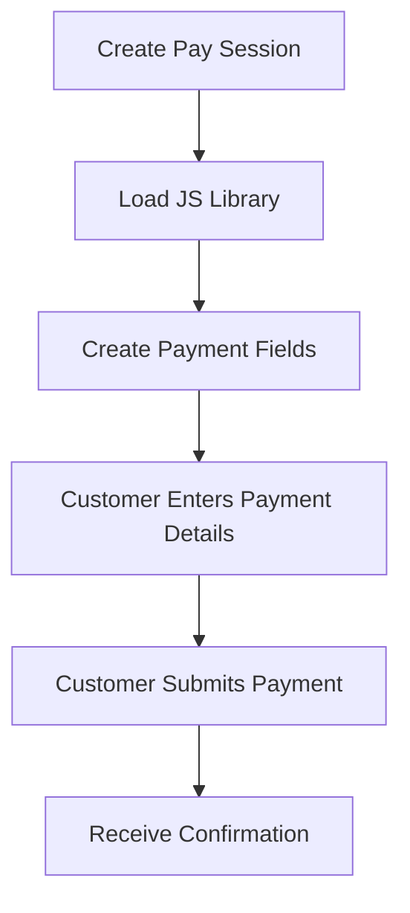
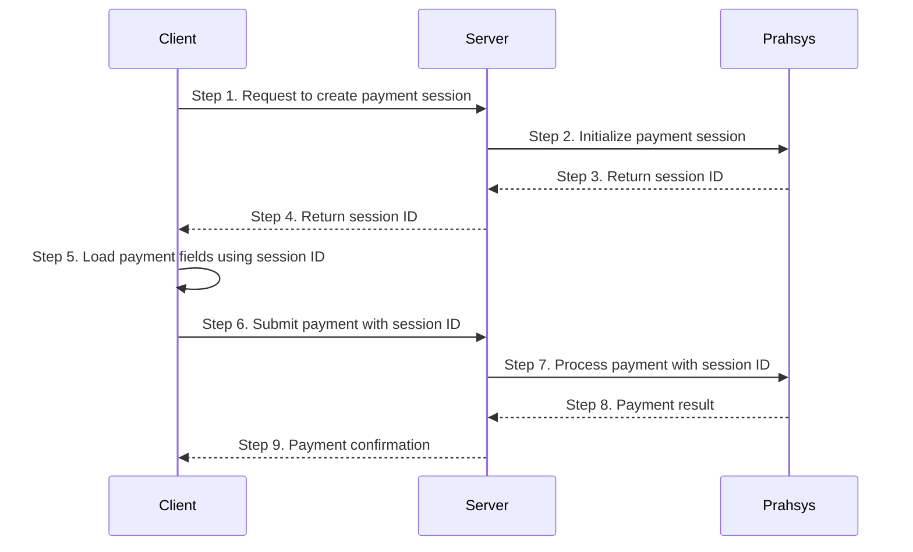

<Recipe slug="pay-session-integration" title="Pay Session" />

<br />

## The Payment Steps



### What is Pay Session

Secure iframe-based card input fields that embed directly into your custom checkout form. You design the page, we provide the secure fields.

### Key Characteristics

* Your branding, layout, and styling
* Iframe fields isolate card data from your servers
* Seamless user experience without redirects
* Moderate PCI compliance requirements

### Best For

* Branded checkout experiences matching your website
* Maintaining control over the complete user flow
* Balance between customization and security

Here is the full payment flow for Pay Session.



## Typescript Interface for PaySession Object

```typescript PaySession Object
  interface Window {
    PaymentSession?: {
      configure: (config: {
        session: string;
        fields: {
          card: {
            number: string;
            securityCode: string;
            expiryMonth: string;
            expiryYear: string;
            nameOnCard: string;
          };
        };
        frameEmbeddingMitigation?: string[];
        callbacks: {
          initialized: (response: { status: "system_error" | "ok"; message?: string }) => void;
          formSessionUpdate: (response: FormSessionUpdateResponse) => void;
        };
      }) => void;
      updateSessionFromForm: (method: "card") => void;
      setFocusStyle: (fields: string[], styles: Record<string, string>) => void;
      setHoverStyle: (fields: string[], styles: Record<string, string>) => void;
      setPlaceholderStyle: (fields: string[], styles: Record<string, string>) => void;
      setPlaceholderShownStyle: (fields: string[], styles: Record<string, string>) => void;
      setFocus: (field: string) => void;
    };
  }

/**
 * PaymentSession callback responses
 */
interface FormSessionUpdateResponse {
  status?: "ok" | "fields_in_error" | "request_timeout" | "system_error";
  session?: {
    id: string;
  };
  sourceOfFunds?: {
    provided: {
      card: {
        securityCode?: boolean;
        scheme?: string;
      };
    };
  };
  errors?: {
    cardNumber?: string;
    expiryYear?: string;
    expiryMonth?: string;
    securityCode?: string;
    message?: string;
  };
}
```

## Styling Payment Fields

1. **setFocus( ):** Sets focus on the specified hosted field.
2. **setFocusStyle( ):** Sets the styling attributes for the specified hosted fields when they gain focus.
3. **setHoverStyle( ):** Sets the styling attributes for the specified hosted fields when a mouse hover occurs over them.
4. **setPlaceholderStyle( ):** Sets the styling attributes for the placeholder text displayed on the specified hosted fields before the payer replaces it with their own entry.
5. **setPlaceholderShownStyle( ):** Sets the styling attributes for the specified hosted fields when the placeholder text is visible.

Pay Session fields can be styled to match your website design:

```javascript Simple Styling Example
PaymentSession.setFocus('card.number');
    
PaymentSession.setFocusStyle(["card.number","card.securityCode"], {
  borderColor: 'red',
  borderWidth: '3px'
});

PaymentSession.setHoverStyle(["card.number","card.securityCode"], {
  borderColor: 'red',
  borderWidth: '3px'
});

PaymentSession.setPlaceholderStyle(["card.number", "card.nameOnCard"], {
  color: 'blue',
  fontWeight: 'bold',
  textDecoration: 'underline'
});
PaymentSession.setPlaceholderShownStyle(["card.number", "card.nameOnCard"], {
  color: 'green',
  fontWeight: 'bold',
  textDecoration: 'underline'
});
```
```typescript Complex Styling Example
// Apply custom styling to match Input component
// Note: PaymentSession only supports: borderColor, borderWidth, color, fontWeight, 
const fields = ["card.number", "card.securityCode", "card.expiryMonth", "card.expiryYear"];

// Inject CSS to force Inter font on PaymentSession iframes
const style = document.createElement("style");
style.textContent = `
	input[id="card-number"],
  input[id="security-code"],
  select[id="expiry-month"],
  select[id="expiry-year"],
  input[id="cardholder-name"] {
  	font-family: 'Inter', -apple-system, BlinkMacSystemFont, 'Segoe UI', Roboto, !important;
    }
`;
document.head.appendChild(style);

PaymentSession?.setFocusStyle(fields, {
  borderColor: primaryColor,
  borderWidth: "2px",
  fontWeight: "400",
});

PaymentSession?.setPlaceholderStyle(fields, {
  color: mutedForeground,
  fontWeight: "400",
});
```

## Using drop-down fields

If you are supporting credit card payments, you can use drop-down values for the hosted fields defining the card expiry month and year.

The following sample code shows how to define the drop-down fields within your payment page’s hosted fields for a credit card payment.

```html
<div>Expiry Month: 
  <select id="expiry-month" class="form-control input-md" required="" readonly>
    <option value="">Select Month</option>
    <option value="01">January</option>
    <option value="02">February</option>
    <option value="03">March</option>
    <option value="04">April</option>
    <option value="05">May</option>
    <option value="06">June</option>
    <option value="07">July</option>
    <option value="08">August</option>
    <option value="09">September</option>
    <option value="10">October</option>
    <option value="11">November</option>
    <option value="12">December</option>
  </select>
</div>
<div>Expiry Year: 
  <select id="expiry-year" class="form-control input-md" required="" readonly>
    <option value="">Select Year</option>
    <option>21</option>
    <option>22</option>
    <option>23</option>
    <option>24</option>
    <option>25</option>
    <option>26</option>
    <option>27</option>
    <option>28</option>
    <option>29</option>
    <option>30</option>
    <option>31</option>
    <option>32</option>
    <option>33</option>
    <option>34</option>
    <option>35</option>
    <option>36</option>
    <option>37</option>
    <option>38</option>
    <option>39</option>
  </select>
</div>
```