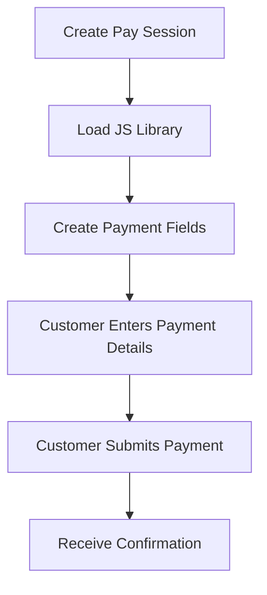

## Quick Comparison

| Feature                  | Pay Portal      | Pay Session          | Pay API               |
| ------------------------ | --------------- | -------------------- | --------------------- |
| **Code Complexity**      | Minimal         | Moderate             | Advanced              |
| **UI Customization**     | Pre-built only  | Full styling control | Complete control      |
| **Card Data Handling**   | Prahsys-hosted  | Iframe fields        | Your choice           |
| **PCI Compliance Level** | SAQ A (easiest) | SAQ A-EP (moderate)  | SAQ D (most complex)* |
| **Best For**             | Quick launches  | Branded checkout     | Recurring billing     |

***

## Pay Portal: Fastest Implementation

### What It Is

A complete, pre-built payment page hosted by Prahsys. You create a session and redirect customers to our secure checkout.

### How It Works

1. Create a session server-side
2. Add our JavaScript library to your page
3. Redirect or embed the payment form
4. Handle the return callback with success/failure indicator

### Choose Pay Portal When:

* You need to accept payments quickly with minimal development
* You're okay with Prahsys-branded payment UI
* You want the lowest PCI compliance burden
* You're processing one-time payments

<Image align="center" border={false} caption="Pay Portal" src="https://files.readme.io/44f9d7d1f98bb4bf1f660119343d828a170be5eb9ddcacdecbe8aa96365a2187-pay-portal.png" width="600em" />

***

## Pay Session: Branded Checkout Experience

 

### What It Is

Secure iframe-based payment fields that embed directly into your custom checkout form. You build the form, we handle the card data through iframes.

### How It Works

1. Create a session server-side
2. Build your custom checkout form with HTML/CSS
3. Load our JavaScript library
4. Bind our secure iframe fields to your form inputs
5. Update session with card data when customer submits
6. Process payment server-side

### Choose Pay Session When:

* You want a branded checkout experience matching your PMS
* You need control over form layout and styling
* You want to maintain your UX flow without redirects
* You're processing one-time payments with custom validation

### Limitations:

* More development effort than Pay Portal
* Still requires session creation for each transaction
* Not ideal for server-to-server recurring billing

***

## Pay API: Maximum Flexibility & Recurring Billing

### What It Is

Direct API integration giving you complete control. Process payments entirely server-to-server using tokens or direct card data.

### Three Approaches

**1. Session-based (Recommended for one-time payments)**

* Reference a Pay Portal or Pay Session to collect card data
* Process payment server-side using the session ID
* Card data never touches your servers

**2. Token-based (Recommended for recurring payments)**

* Collect card details once via Portal or Session
* Tokenize the card information
* Use tokens for all future server-to-server charges
* Lowest PCI scope for recurring billing

**3. Direct Pay (Highest PCI scope)**

* Pass raw card details directly in API calls
* Your servers handle sensitive card data
* Maximum control but maximum compliance burden

### Transaction Types

* **PAY** - Single-step payment (authorize + capture combined)
* **AUTHORIZE** - Reserve funds without capturing
* **CAPTURE** - Capture previously authorized funds
* **VERIFY** - Validate card details without charging
* **REFUND** - Return funds to customer
* **VOID** - Cancel pending transaction

### Choose Pay API When:

* You're building subscription or recurring billing features
* You need server-to-server payment processing
* You want complete control over the payment flow
* You're building complex payment logic (split payments, installments)
* You need to process payments without user interaction

### Limitations:

* Most development effort required
* Direct Pay increases PCI compliance requirements (SAQ D)
* More complex error handling needed

***

## PCI Compliance Considerations

### Pay Portal (SAQ A - Easiest)

* Card data never touches your servers
* Prahsys handles all sensitive data
* Annual self-assessment questionnaire
* No vulnerability scanning required

### Pay Session (SAQ A-EP - Moderate)

* Card data enters iframes, never your servers
* You control the checkout page HTML/CSS
* Annual self-assessment questionnaire
* Quarterly vulnerability scans required

### Pay API with Sessions or Tokens (SAQ D - Reduced Scope)

* Card data collected via Portal/Session, then tokenized
* Your servers only handle tokens
* Annual audit by QSA recommended
* Quarterly vulnerability scans required

### Pay API with Direct Pay (SAQ D - Full Scope)

* Card data passes through your servers
* **Highest compliance requirements**
* Annual audit by QSA required
* Quarterly vulnerability scans required
* Extensive security controls needed

***

## Decision Tree

**Start here:** What's your primary use case?

### One-time payments with minimal development

→ **Use Pay Portal**

### One-time payments with branded checkout

→ **Use Pay Session**

### Recurring billing or subscriptions

→ **Use Pay API with tokens**

* Collect card details initially with Pay Portal or Pay Session
* Tokenize the card
* Process recurring charges server-to-server with tokens

### Complex payment flows requiring full control

→ **Use Pay API**

* Consider session-based or token-based to reduce PCI scope
* Only use Direct Pay if absolutely necessary

***

## Common Integration Patterns

### Pattern 1: Simple One-Time Checkout

**Solution:** Pay Portal  
**Effort:** Minimal  
**PCI:** SAQ A

### Pattern 2: Branded One-Time Checkout

**Solution:** Pay Session  
**Effort:** Moderate  
**PCI:** SAQ A-EP

### Pattern 3: Monthly Subscriptions

**Solution:** Pay Session (initial) + Pay API with tokens (recurring)  
**Effort:** Moderate to Advanced  
**PCI:** SAQ A-EP + SAQ D (reduced)

### Pattern 4: Payment Plans / Installments

**Solution:** Pay Session (initial) + Pay API with tokens (installments)  
**Effort:** Advanced  
**PCI:** SAQ A-EP + SAQ D (reduced)

### Pattern 5: Server-to-Server Batch Processing

**Solution:** Pay API with tokens only  
**Effort:** Advanced  
**PCI:** SAQ D (reduced)

***

## Key Takeaways

1. **Start with the simplest solution** that meets your needs - you can always upgrade later

2. **Avoid Direct Pay** unless you have a specific requirement - it significantly increases compliance burden

3. **For recurring billing**, use Pay Session or Pay Portal to collect cards, then tokenize and use Pay API

4. **Card data should never touch your servers** unless absolutely necessary - let Prahsys handle it through sessions or tokens

5. **All three methods are production-ready** - choose based on your use case, not assumed quality differences
