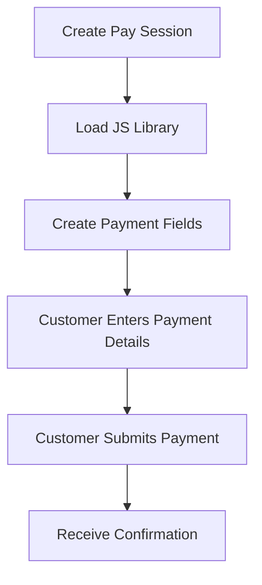

## Quick Comparison

| Feature                  | Pay Portal      | Pay Session          | Pay API               |
| ------------------------ | --------------- | -------------------- | --------------------- |
| **Code Complexity**      | Minimal         | Moderate             | Advanced              |
| **UI Customization**     | Pre-built only  | Full styling control | Complete control      |
| **Card Data Handling**   | Prahsys-hosted  | Iframe fields        | Your choice           |
| **PCI Compliance Level** | SAQ A (easiest) | SAQ A-EP (moderate)  | SAQ D (most complex)* |

***

## Pay Portal: Pre-Built Payment Page

### What It Is

A complete, Prahsys-hosted checkout page. Your customers are redirected to our secure environment where all card data is collected and processed.

### Key Characteristics

* Fully managed payment interface
* Prahsys branding and design
* Card data never touches your servers
* Lowest PCI compliance requirements

### Best For

* Rapid deployment with minimal engineering effort
* One-time payment scenarios
* Teams prioritizing speed over customization

<Image align="center" border={false} caption="Pay Portal" src="https://files.readme.io/44f9d7d1f98bb4bf1f660119343d828a170be5eb9ddcacdecbe8aa96365a2187-pay-portal.png" width="600em" />

***

## Pay Session: Custom-Styled Payment Fields

### What It Is

Secure iframe-based card input fields that embed directly into your custom checkout form. You design the page, we provide the secure fields.

### Key Characteristics

* Your branding, layout, and styling
* Iframe fields isolate card data from your servers
* Seamless user experience without redirects
* Moderate PCI compliance requirements

### Best For

* Branded checkout experiences matching your website
* Maintaining control over the complete user flow
* Balance between customization and security

***

## Pay API: Direct Card Information

### What It Is

Server-to-server API integration where raw card data is transmitted directly in API requests to Prahsys for processing.

### Key Characteristics

* Complete technical control over payment flow
* Card data passes through your infrastructure
* Requires special approval from Prahsys
* Highest PCI compliance requirements (SAQ D)

### Best For

* Specialized payment workflows requiring direct card handling
* Organizations with existing PCI Level 1 compliance infrastructure
* Advanced use cases where Portal and Session cannot meet requirements

***

## PCI Compliance Considerations

### Pay Portal (SAQ A - Easiest)

* Card data exclusively on Prahsys servers
* Annual self-assessment questionnaire
* No vulnerability scanning required

### Pay Session (SAQ A-EP - Moderate)

* Card data contained within iframes
* Annual self-assessment questionnaire
* Quarterly vulnerability scans required

### Pay API (SAQ D - Full Scope)

* Card data transits your server infrastructure
* Annual audit by Qualified Security Assessor (QSA)
* Quarterly vulnerability scans required
* Extensive security controls and documentation
