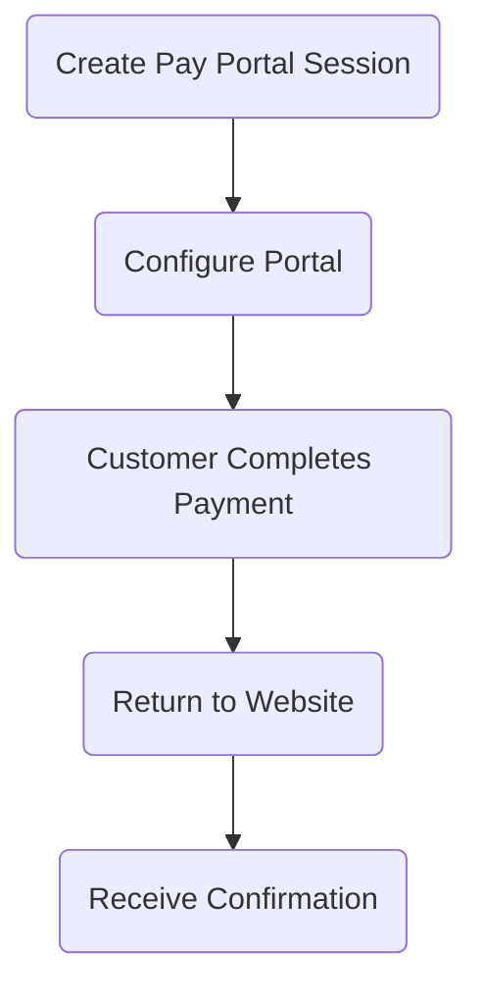

<Recipe slug="pay-portal-integration" title="Pay Portal Integration" />

<br />

<Callout theme="default">
  **Payment ID**s are created/generated by you before making API calls. These IDs should be unique identifiers
  in your system and are passed in the request URLs. You can use your own Payment ID or create one using the
</Callout>

<Image align="center" border={false} src="https://files.readme.io/0a911aa0848b5f40688b75512804acf7ee5437e4e24693ab1a7c5a461be5fa2d-pay-portal.png" />

## Key Features

* **Complete Payment Form**: Includes all necessary fields and validation
* **Secure Processing**: Handles PCI compliance requirements
* **Payment Methods**: Support for credit cards and tokenized payments
* **Responsive Design**: Works on all devices and screen sizes

## How It Works



## Integration Steps

### Step 1: Create a Pay Portal Session

To create a Pay Portal session, send a POST request to our Pay Session API endpoint and include the `"portal"` object in the request:

> If the `"portal"` object is not included in the request, then a **pay session** will be created.
>
> Allowed operations are: `PAY`, `AUTHORIZE`, `VERIFY`, or `NONE`.
>
> Using the `NONE` operation just stores card information in the session.
> You can later use the session id to tokenize the card details.

The session object will contain the session ID and successIndicator

### Step 2: Configure the Pay Portal on the Client Side

Add the Pay Portal JavaScript library to your checkout page and configure it with the session ID:

```html Checkout Library
<!-- Include the Pay Portal JavaScript library -->
<script src="https://secure.prahsys.com/static/checkout/checkout.min.js"></script>
```

After loading the script, `Checkout` object is loaded to the window.

```javascript window PaySession object
// Configure the Pay Portal with the session ID
window.Checkout.configure({
  session: {
    id: session.data.id, // The session ID from Step 1
  },
});
```

### Step 3: Show the Payment Page

After configuring the Pay Portal, you need to launch the payment page. There are two ways to do this:

#### Option 1: Redirect to the Payment Page

```javascript Redirect to Payment Portal
// Launch the Pay Portal payment page
window.Checkout.showPaymentPage();
```

#### Option 2: Embedded Payment Page

If you want to embed the payment page in your website:

```html Embedded Payment Portal
<!-- Create a container for the embedded payment page -->
<div id="embedded-pay-portal"></div>
```

```javascript Show Embedded Payment Portal
// Launch the Pay Portal in embedded mode
window.Checkout.showEmbeddedPage("#embedded-pay-portal");
```

### Step 3.1: Test Mode

Grab a test card from our [Test Payment Cards](doc:test-payment-cards) page to test the payment flow in the sandbox environment.

### Step 4: Handle the Response

When the payment is complete, the customer will be redirected to the `returnUrl` specified in Step 1. The session response from Step 1 includes a `successIndicator` value that you can use to verify the payment status.

#### Using the successIndicator

The `successIndicator` is a unique identifier returned in the session creation response that helps you verify the payment result.

When the customer completes payment and is redirected to your `returnUrl`, you can check for the `resultIndicator` parameter in the redirect URL:

```javascript Checking Success
// On your return URL handler
const resultIndicator = req.query.resultIndicator;

// Compare with the stored successIndicator
if (resultIndicator === successIndicator) {
  // Payment successful - fulfill the order
} else {
  // Payment failed or was canceled
}
```

You should also verify the payment status via the API before fulfilling orders to ensure complete security.

## Best Practices

* Always create Pay Portal sessions server-side, never client-side
* Configure the Pay Portal client-side with just the minimal required session ID
* Store the `successIndicator` securely on your server (not in browser storage or cookies)
* Always compare the `resultIndicator` with the stored `successIndicator` to verify payment success
* Verify the payment status via the API before fulfilling orders
* Use HTTPS for all communications
* Test all payment flows in the sandbox environment before deploying to production
