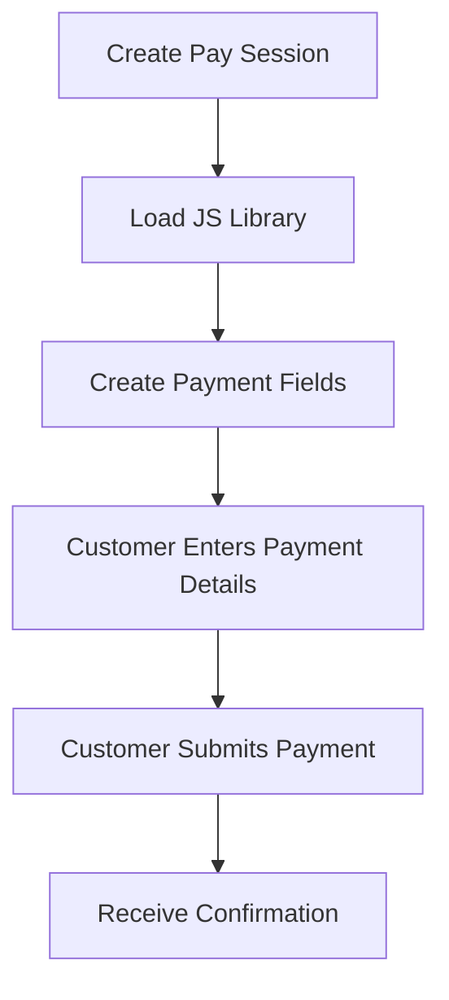
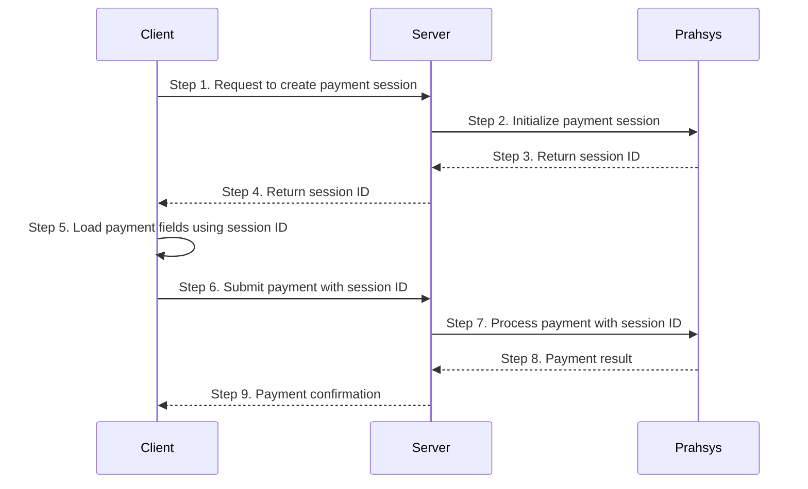

<Recipe slug="pay-session-integration" title="Pay Session" />

<br />

## The Payment Steps



### What is Pay Session

Secure iframe-based card input fields that embed directly into your custom checkout form. You design the page, we provide the secure fields.

### Key Characteristics

* Your branding, layout, and styling
* Iframe fields isolate card data from your servers
* Seamless user experience without redirects
* Moderate PCI compliance requirements

### Best For

* Branded checkout experiences matching your website
* Maintaining control over the complete user flow
* Balance between customization and security

Here is the full payment flow for Pay Session.



## Loading the Script

After creating a session server-side, load the Pay Session script in your checkout page. The script URL embeds the merchant ID and session ID, so each script tag is unique per session.

```html PaySession Script
<script src="https://gateway.prahsys.com/n1/merchant/{merchantId}/session/{sessionId}/script.js"></script>
```

Once loaded, the script registers `window.PaymentSession`, which is the object you use to configure fields, collect input, and style the iframes.

<Callout icon="❗️" theme="error">
  When working with a SANDBOX merchant and loading PaySession or PayPortal script, you must use your test API key to create the session (sk_test_123...)
</Callout>

## Supported Fields

Pay Session currently supports card payments. Each entry below is a key under `fields.card` in your `configure()` call and maps a CSS selector in your page to a secure iframe.

| Field | Description |
| --- | --- |
| `number` | Card number (13–19 digits, Luhn-validated) |
| `securityCode` | CVV / CSC (3–4 digits) |
| `expiryMonth` | Expiry month, `MM` |
| `expiryYear` | Expiry year, `YY` |
| `expiryDate` | Combined `MM/YY` expiry (use instead of `expiryMonth` + `expiryYear`) |
| `nameOnCard` | Cardholder name |

You can mix and match — for example, use the combined `expiryDate` field if you want a single input instead of separate month/year fields.

## TypeScript Interface for PaymentSession

```typescript PaymentSession Types
declare global {
  interface Window {
    PaymentSession: PaymentSession;
  }
}

interface PaymentSession {
  /**
   * Initialize the session: replace your input elements with secure iframes
   * and wire up callbacks.
   */
  configure(config: PaymentSessionConfig): void;

  /**
   * Collect values from all configured fields and submit them to the
   * session. The formSessionUpdate callback fires with the result.
   * Resolves on success, rejects on system error.
   */
  updateSessionFromForm(formType: "card"): Promise<void>;

  /**
   * Generic style setter — accepts any combination of states.
   */
  setStyle(fields: string[], styles: StyleConfig): void;

  /** Convenience: style applied on focus. */
  setFocusStyle(fields: string[], styles: FieldStyles): void;

  /** Convenience: style applied on hover. */
  setHoverStyle(fields: string[], styles: FieldStyles): void;

  /** Convenience: style applied to the placeholder pseudo-element. */
  setPlaceholderStyle(fields: string[], styles: FieldStyles): void;

  /** Convenience: style applied when a field is in the error state. */
  setErrorStyle(fields: string[], styles: FieldStyles): void;

  /** Convenience: style applied when a field is in the valid state. */
  setValidStyle(fields: string[], styles: FieldStyles): void;

  /**
   * Programmatically set the visual state of one or more fields.
   * Pass null to clear the state.
   */
  setFieldState(fields: string[], state: "error" | "valid" | null): void;
}

interface PaymentSessionConfig {
  /**
   * Optional. The session ID is already embedded in the script URL; if
   * provided here it must match.
   */
  session?: string;

  fields: {
    card?: {
      number?: string;
      securityCode?: string;
      expiryMonth?: string;
      expiryYear?: string;
      expiryDate?: string;
      nameOnCard?: string;
    };
  };

  /** Clickjacking mitigation strategies. */
  frameEmbeddingMitigation?: Array<"javascript" | "x-frame-options" | "csp">;

  callbacks: {
    /** Fires once all configured iframes are mounted and ready. */
    initialized: (response: InitializedResponse) => void;

    /** Fires with the result of updateSessionFromForm(). */
    formSessionUpdate: (response: FormSessionUpdateResponse) => void;
  };
}

interface InitializedResponse {
  status: "ok" | "error";
  message?: string;
}

interface FormSessionUpdateResponse {
  status: "ok" | "fields_in_error" | "system_error";
  session?: {
    id: string;
    version?: number;
  };
  /**
   * Field-level validation errors. Keys are field names; values are
   * short error codes: "required" or "invalid".
   */
  errors?: {
    number?: string;
    securityCode?: string;
    expiryMonth?: string;
    expiryYear?: string;
    expiryDate?: string;
    nameOnCard?: string;
  };
}

interface StyleConfig {
  default?: FieldStyles;
  hover?: FieldStyles;
  focus?: FieldStyles;
  error?: FieldStyles;
  valid?: FieldStyles;
  placeholder?: FieldStyles;
}

interface FieldStyles {
  [cssProperty: string]: string;
}
```

## Configuring a Session

A minimal `configure()` call wires field selectors to iframes and registers your callbacks.

```javascript Minimal Configuration
PaymentSession.configure({
  fields: {
    card: {
      number: "#card-number",
      securityCode: "#security-code",
      expiryMonth: "#expiry-month",
      expiryYear: "#expiry-year",
      nameOnCard: "#cardholder-name",
    },
  },
  frameEmbeddingMitigation: ["javascript"],
  callbacks: {
    initialized: function (response) {
      if (response.status === "ok") {
        // Fields are mounted — reveal your form.
      }
    },
    formSessionUpdate: function (response) {
      if (response.status === "ok") {
        // response.session.id is the updated session — send to your server.
      } else if (response.status === "fields_in_error") {
        // response.errors contains per-field codes; see "Handling Validation Errors".
      }
    },
  },
});
```

When the customer is ready to pay, call `updateSessionFromForm("card")`. The cached field values are validated together and the `formSessionUpdate` callback fires with the result.

```javascript Submit Card Data
PaymentSession.updateSessionFromForm("card");
```

## Styling Payment Fields

Pay Session exposes per-state styling methods so the iframes blend into your design.

1. **`setFocusStyle()`** — styles applied while a field has focus.
2. **`setHoverStyle()`** — styles applied while the cursor hovers a field.
3. **`setPlaceholderStyle()`** — styles applied to the placeholder pseudo-element.
4. **`setErrorStyle()`** — styles applied when a field is in the error state (set automatically on validation failure, or manually via `setFieldState`).
5. **`setValidStyle()`** — styles applied when a field is in the valid state.
6. **`setStyle()`** — generic setter that accepts any combination of the above states in a single call.
7. **`setFieldState()`** — programmatically toggle a field into the error or valid state (or pass `null` to clear).

<Callout icon="ℹ️" theme="info">
  Only a whitelist of CSS properties is honored inside the iframes — typography (font, color, line-height, letter-spacing, text-align), padding, border, border-radius, background, box-shadow, outline, and opacity. Unsupported properties (margin, width, position, transforms, etc.) are silently ignored. Layout of the iframe itself is controlled by your outer container.
</Callout>

```javascript Simple Styling Example
PaymentSession.setFocusStyle(["card.number", "card.securityCode"], {
  borderColor: "red",
  borderWidth: "3px",
});

PaymentSession.setHoverStyle(["card.number", "card.securityCode"], {
  borderColor: "red",
  borderWidth: "3px",
});

PaymentSession.setPlaceholderStyle(["card.number", "card.nameOnCard"], {
  color: "blue",
  fontWeight: "bold",
});

PaymentSession.setErrorStyle(["card.number", "card.securityCode"], {
  borderColor: "#ef4444",
  borderWidth: "2px",
  boxShadow: "0 0 0 3px rgba(239, 68, 68, 0.1)",
});

PaymentSession.setValidStyle(["card.number"], {
  borderColor: "#10b981",
});
```

```typescript Complex Styling Example
const fields = [
  "card.number",
  "card.securityCode",
  "card.expiryMonth",
  "card.expiryYear",
];

// Inject CSS to force a font on the underlying iframe inputs
const style = document.createElement("style");
style.textContent = `
  input[id="card-number"],
  input[id="security-code"],
  input[id="expiry-month"],
  input[id="expiry-year"],
  input[id="cardholder-name"] {
    font-family: 'Inter', -apple-system, BlinkMacSystemFont, 'Segoe UI', Roboto, sans-serif !important;
  }
`;
document.head.appendChild(style);

PaymentSession.setFocusStyle(fields, {
  borderColor: "#3b82f6",
  borderWidth: "2px",
  fontWeight: "400",
});

PaymentSession.setPlaceholderStyle(fields, {
  color: "#9ca3af",
  fontWeight: "400",
});

// Or set all states in a single call
PaymentSession.setStyle(fields, {
  focus: { borderColor: "#3b82f6", borderWidth: "2px" },
  error: { borderColor: "#ef4444", borderWidth: "2px" },
  valid: { borderColor: "#10b981" },
});
```

## Using Drop-down Fields

If you prefer drop-down inputs for expiry, define standard `<select>` elements and reference them by selector. Pay Session reads the selected value just like a text input.

```html
<div>Expiry Month: 
  <select id="expiry-month" class="form-control input-md" required readonly>
    <option value="">Select Month</option>
    <option value="01">January</option>
    <option value="02">February</option>
    <option value="03">March</option>
    <option value="04">April</option>
    <option value="05">May</option>
    <option value="06">June</option>
    <option value="07">July</option>
    <option value="08">August</option>
    <option value="09">September</option>
    <option value="10">October</option>
    <option value="11">November</option>
    <option value="12">December</option>
  </select>
</div>
<div>Expiry Year: 
  <select id="expiry-year" class="form-control input-md" required readonly>
    <option value="">Select Year</option>
    <option>25</option>
    <option>26</option>
    <option>27</option>
    <option>28</option>
    <option>29</option>
    <option>30</option>
    <option>31</option>
    <option>32</option>
    <option>33</option>
    <option>34</option>
    <option>35</option>
  </select>
</div>
```

## Handling Validation Errors

When `updateSessionFromForm()` finds problems with the submitted values, `formSessionUpdate` fires with `status: "fields_in_error"` and an `errors` object keyed by field name. The error value is a short code — typically `"required"` or `"invalid"` — that you map to a user-friendly message.

```javascript Validation Error Handling
const errorMessages = {
  required: "This field is required",
  invalid: "Please enter a valid value",
};

function showFieldErrors(errors) {
  // Mark fields in error so setErrorStyle takes effect
  PaymentSession.setFieldState(Object.keys(errors), "error");

  Object.entries(errors).forEach(([fieldName, code]) => {
    const messageEl = document.getElementById(`${fieldName}-error`);
    if (messageEl) {
      messageEl.textContent = errorMessages[code] || code;
      messageEl.classList.remove("hidden");
    }
  });
}

PaymentSession.configure({
  fields: {
    card: {
      number: "#card-number",
      securityCode: "#security-code",
      expiryMonth: "#expiry-month",
      expiryYear: "#expiry-year",
      nameOnCard: "#cardholder-name",
    },
  },
  callbacks: {
    initialized: () => {},
    formSessionUpdate: (response) => {
      if (response.status === "ok") {
        // Forward response.session.id to your server to charge the card
      } else if (response.status === "fields_in_error" && response.errors) {
        showFieldErrors(response.errors);
      }
    },
  },
});
```

When the customer corrects the input and resubmits, the previous error states are cleared automatically before the new submission is validated.