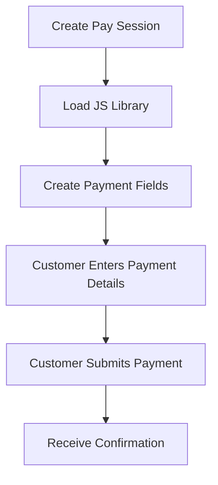
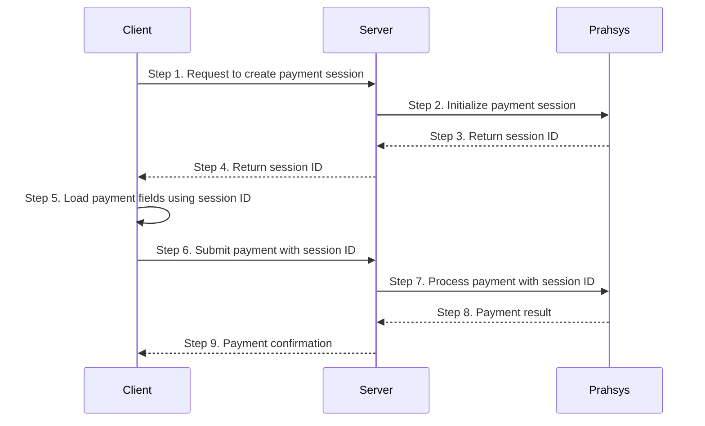

## How It Works



## Creating a Pay Session

To create a Pay Session, send a POST request to our API:

```javascript filename="Server-side JavaScript"
const response = await fetch("https://api.prahsys.com/payments/n1/merchant/{merchantId}/session", {
  method: "POST",
  headers: {
    Authorization: `Bearer ${apiKey}`,
    "Content-Type": "application/json",
  },
  body: JSON.stringify({
    payment: {
      id: "PAYMENT-123",
      amount: 99.99,
      description: "Premium subscription",
    },
  }),
});

// Pass session.data.id to your frontend
const session = await response.json();
```

The session object will contain the session ID

```json filename=" Session Object from the response json"
// session = response.json()
{
  "success": true,
  "message": "Session created",
  "data": {
    "id": "SESSION0002776555072F1187121H61"
  }
}
```

## Client-Side Integration Example

Here is an example Client Side Pay Session integration:

```html filename="Client-side HTML"
<!DOCTYPE html>
<html>
  <head>
    <!-- Include the Pay Session JavaScript library -->
    <script src="https://secure.prahsys.com/form/version/100/merchant/{merchantId}/session.js"></script>
    <!-- Apply click-jacking styling and hide contents of the page -->
    <style id="antiClickjack">
      body {
        display: none !important;
      }
    </style>
  </head>
  <body>
    <!-- Create the HTML for the payment page -->
    <div>Please enter your payment details:</div>
    <div>Cardholder Name: <input type="text" id="cardholder-name" class="input-field" value="" readonly /></div>
    <div>Card Number: <input type="text" id="card-number" class="input-field" value="" readonly /></div>
    <div>Expiry Month: <input type="text" id="expiry-month" class="input-field" value="" readonly /></div>
    <div>Expiry Year: <input type="text" id="expiry-year" class="input-field" value="" readonly /></div>
    <div>Security Code: <input type="text" id="security-code" class="input-field" value="" readonly /></div>

    <button id="payButton" onclick="pay();">Pay Now</button>

    <script type="text/javascript">
      // JavaScript frame-breaker code to provide protection against iframe click-jacking
      if (self === top) {
        var antiClickjack = document.getElementById("antiClickjack");
        antiClickjack.parentNode.removeChild(antiClickjack);
      } else {
        top.location = self.location;
      }

      // Configure the Pay Session
      PaymentSession.configure({
        session: {id: sessionId},
        fields: {
          // Attach hosted fields to your payment page for a credit card
          card: {
            number: "#card-number",
            securityCode: "#security-code",
            expiryMonth: "#expiry-month",
            expiryYear: "#expiry-year",
            nameOnCard: "#cardholder-name"
          }
        },
        // Specify your clickjacking mitigation option here
        frameEmbeddingMitigation: ["javascript"],
        callbacks: {
          initialized: function(response) {
            // Handle initialization response
            console.log("Session initialized successfully");
          },
          formSessionUpdate: function(response) {
            // Handle form session update response
            console.log("Session updated with card data");

            if (response.status) {
              if ("ok" === response.status) {
                console.log("Session updated successfully");

                // Card details updated successfully - you can submit the form
                document.getElementById("payButton").disabled = false;
              } else if ("fields_in_error" === response.status) {
                console.log("Session update failed: " + response.errors.join());

                // Card details update failed - you can show appropriate error messages
                document.getElementById("payButton").disabled = true;
              } else if ("request_timeout" === response.status) {
                console.log("Session update failed: request timed out");

                // Card details update failed - you can show appropriate error messages
                document.getElementById("payButton").disabled = true;
              } else if ("system_error" === response.status) {
                console.log("Session update failed: system error");

                // Card details update failed - you can show appropriate error messages
                document.getElementById("payButton").disabled = true;
              }
            }
          }
        }
      });

      function pay() {
        // Update the session with the card details
        PaymentSession.updateSessionFromForm('card');

        // Here you'd typically send the sessionId to your server to process the payment
        fetch('https://your-server.com/process-payment', {
          method: 'POST',
          headers: {
            'Content-Type': 'application/json'
          },
          body: JSON.stringify({
            sessionId: sessionId // The sessionId you received from your server
          })
        })
        .then(response => response.json())
        .then(data => {
          if (data.success) {
            window.location.href = '/success-page';
          } else {
            // Handle payment error
            console.error('Payment failed:', data.error);
          }
        })
        .catch(error => {
          console.error('Error processing payment:', error);
        });
      }
    </script>
  </body>
</html>
```

## Server-Side Payment Processing

After the client has completed the form and submitted the payment, your server needs to process the transaction:

```javascript filename="Server-side JavaScript"
// Process the payment after the session has been updated with card details
async function processPayment(sessionId) {
  try {
    const response = await fetch(`https://api.prahsys.com/payments/n1/merchant/{merchantId}/payment/PAYMENT-123/pay`, {
      method: "POST",
      headers: {
        Authorization: `Bearer ${apiKey}`,
        "Content-Type": "application/json",
      },
      body: JSON.stringify({
        payment: {
          amount: 12.99,
        },
        session: {
          id: sessionId,
        },
      }),
    });

    const result = await response.json();
    return result;
  } catch (error) {
    console.error("Error processing payment:", error);
    throw error;
  }
}
```

Here is the full payment flow for Pay Session.



## Styling Payment Fields

Pay Session fields can be styled to match your website design:

```javascript filename="Client-side JavaScript"
// Add styling to the payment fields when in focus
PaymentSession.setFocusStyle(
  ["card.number", "card.securityCode", "card.expiryMonth", "card.expiryYear", "card.nameOnCard"],
  {
    backgroundColor: "#f3f4f6",
    fontWeight: "bold",
  },
);

// You can also set hover styles
PaymentSession.setHoverStyle(
  ["card.number", "card.securityCode", "card.expiryMonth", "card.expiryYear", "card.nameOnCard"],
  {
    backgroundColor: "#f3f4f6",
  },
);
```

## Updating a Session

You can update a session if payment details change:

```javascript filename="Server-side JavaScript"
// Update session with new payment details
async function updatePaymentSession(sessionId, newAmount, newDescription) {
  try {
    const response = await fetch(`https://api.prahsys.com/payments/n1/merchant/{merchantId}/session/${sessionId}`, {
      method: "PUT",
      headers: {
        Authorization: `Bearer ${apiKey}`,
        "Content-Type": "application/json",
      },
      body: JSON.stringify({
        payment: {
          amount: newAmount, // Updated amount
          currency: "USD",
          description: newDescription,
        },
      }),
    });

    if (!response.ok) {
      throw new Error(`Failed to update session: ${response.status} ${response.statusText}`);
    }

    const updatedSession = await response.json();
    return updatedSession;
  } catch (error) {
    console.error("Error updating payment session:", error);
    throw error;
  }
}
```

## Server-Side Confirmation

Always verify the payment status on your server before fulfilling orders:

```javascript filename="Server-side JavaScript"
// Verify payment status
async function verifyPaymentStatus(sessionId) {
  try {
    const response = await fetch(`https://api.prahsys.com/payments/n1/merchant/{merchantId}/session/${sessionId}`, {
      method: "GET",
      headers: {
        Authorization: `Bearer ${apiKey}`,
      },
    });

    const sessionData = await response.json();

    // Process based on session status
    switch (sessionData.status) {
      case "CAPTURED":
        // Payment completed successfully
        console.log("Payment successful for order:", sessionData.payment.reference);
        // Fulfill the order
        await fulfillOrder(sessionData.payment.id);
        // Send confirmation email
        await sendOrderConfirmation(sessionData.customer.email, sessionData);
        return { success: true, session: sessionData };

      case "PENDING":
        // Payment is still being processed
        console.log("Payment pending for order:", sessionData.payment.reference);
        // Record pending status
        recordPendingPayment(sessionData.id);
        return { success: false, status: "pending", session: sessionData };

      case "FAILED":
        // Payment failed
        console.error("Payment failed for order:", sessionData.payment.reference);
        // Record failure reason
        recordPaymentFailure(sessionData.id, sessionData.result);
        return { success: false, status: "failed", session: sessionData };

      default:
        console.warn("Unknown payment status:", sessionData.status);
        return { success: false, status: "unknown", session: sessionData };
    }
  } catch (error) {
    console.error("Error verifying payment status:", error);
    throw error;
  }
}
```
