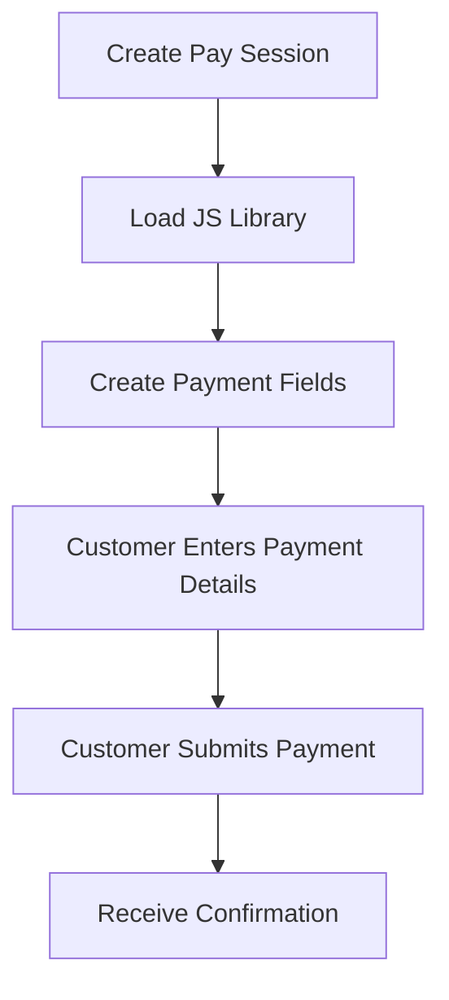
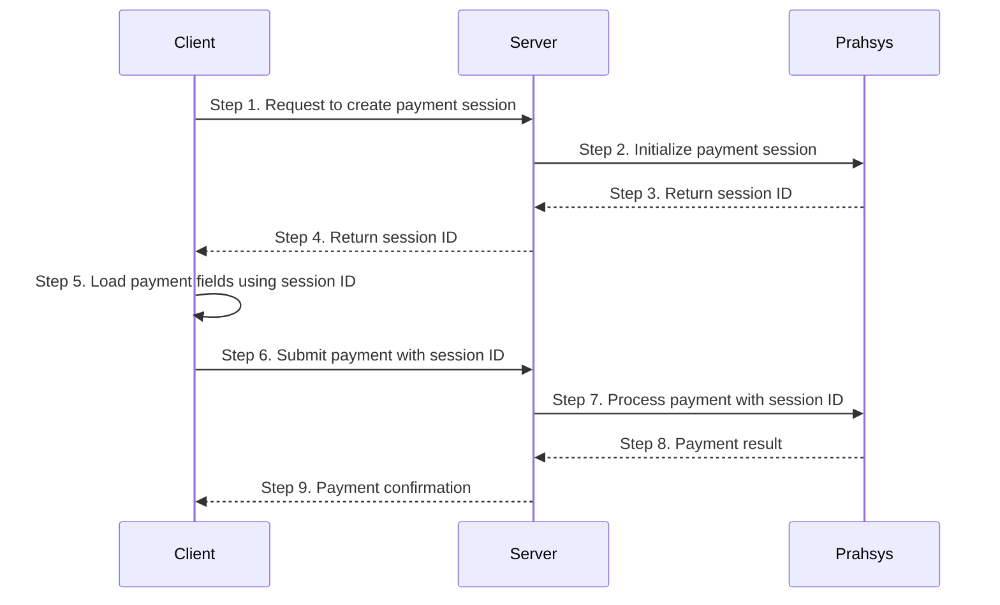

TODO: Follow RECEIPT

## The Payment Steps



### What is Pay Session

Secure iframe-based card input fields that embed directly into your custom checkout form. You design the page, we provide the secure fields.

### Key Characteristics

* Your branding, layout, and styling
* Iframe fields isolate card data from your servers
* Seamless user experience without redirects
* Moderate PCI compliance requirements

### Best For

* Branded checkout experiences matching your website
* Maintaining control over the complete user flow
* Balance between customization and security

Here is the full payment flow for Pay Session.



## Interface for PaySession Object

```typescript PaySession Object
  interface Window {
    PaymentSession?: {
      configure: (config: {
        session: string;
        fields: {
          card: {
            number: string;
            securityCode: string;
            expiryMonth: string;
            expiryYear: string;
            nameOnCard: string;
          };
        };
        frameEmbeddingMitigation?: string[];
        callbacks: {
          initialized: (response: { status: "system_error" | "ok"; message?: string }) => void;
          formSessionUpdate: (response: FormSessionUpdateResponse) => void;
        };
      }) => void;
      updateSessionFromForm: (method: "card") => void;
      setFocusStyle: (fields: string[], styles: Record<string, string>) => void;
      setHoverStyle: (fields: string[], styles: Record<string, string>) => void;
      setPlaceholderStyle: (fields: string[], styles: Record<string, string>) => void;
      setPlaceholderShownStyle: (fields: string[], styles: Record<string, string>) => void;
      setFocus: (field: string) => void;
    };
  }

/**
 * PaymentSession callback responses
 */
interface FormSessionUpdateResponse {
  status?: "ok" | "fields_in_error" | "request_timeout" | "system_error";
  session?: {
    id: string;
  };
  sourceOfFunds?: {
    provided: {
      card: {
        securityCode?: boolean;
        scheme?: string;
      };
    };
  };
  errors?: {
    cardNumber?: string;
    expiryYear?: string;
    expiryMonth?: string;
    securityCode?: string;
    message?: string;
  };
}
```

## Styling Payment Fields

Pay Session fields can be styled to match your website design:

```javascript Simple Styling Example
// Add styling to the payment fields when in focus
PaymentSession.setFocusStyle(
  ["card.number", "card.securityCode", "card.expiryMonth", "card.expiryYear", "card.nameOnCard"],
  {
    backgroundColor: "#f3f4f6",
    fontWeight: "bold",
  },
);

// You can also set hover styles
PaymentSession.setHoverStyle(
  ["card.number", "card.securityCode", "card.expiryMonth", "card.expiryYear", "card.nameOnCard"],
  {
    backgroundColor: "#f3f4f6",
  },
);
```
```typescript Complex Styling Example
// Apply custom styling to match Input component
// Note: PaymentSession only supports: borderColor, borderWidth, color, fontWeight, 
const fields = ["card.number", "card.securityCode", "card.expiryMonth", "card.expiryYear"];

// Inject CSS to force Inter font on PaymentSession iframes
const style = document.createElement("style");
style.textContent = `
	input[id="card-number"],
  input[id="security-code"],
  select[id="expiry-month"],
  select[id="expiry-year"],
  input[id="cardholder-name"] {
  	font-family: 'Inter', -apple-system, BlinkMacSystemFont, 'Segoe UI', Roboto, !important;
    }
`;
document.head.appendChild(style);

PaymentSession?.setFocusStyle(fields, {
  borderColor: primaryColor,
  borderWidth: "2px",
  fontWeight: "400",
});

PaymentSession?.setPlaceholderStyle(fields, {
  color: mutedForeground,
  fontWeight: "400",
});
```

<br />
