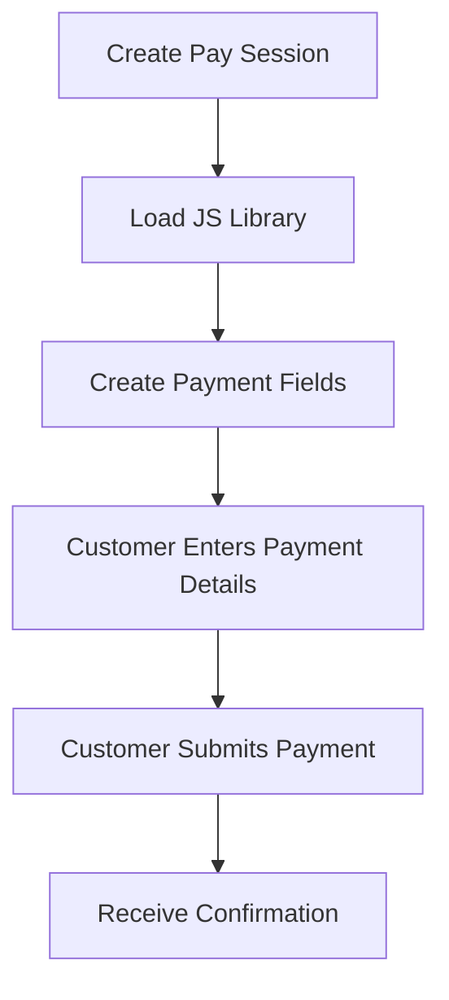
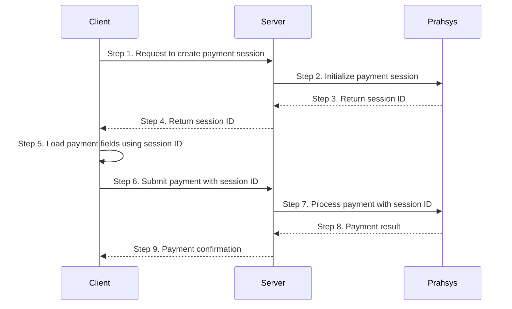

TODO: Follow RECEIPT

## The Payment Steps



### What is Pay Session

Secure iframe-based card input fields that embed directly into your custom checkout form. You design the page, we provide the secure fields.

### Key Characteristics

* Your branding, layout, and styling
* Iframe fields isolate card data from your servers
* Seamless user experience without redirects
* Moderate PCI compliance requirements

### Best For

* Branded checkout experiences matching your website
* Maintaining control over the complete user flow
* Balance between customization and security

Here is the full payment flow for Pay Session.



## Interface for PaySession Object

```typescript PaySession Object
  interface Window {
    PaymentSession?: {
      configure: (config: {
        session: string;
        fields: {
          card: {
            number: string;
            securityCode: string;
            expiryMonth: string;
            expiryYear: string;
            nameOnCard: string;
          };
        };
        frameEmbeddingMitigation?: string[];
        callbacks: {
          initialized: (response: { status: "system_error" | "ok"; message?: string }) => void;
          formSessionUpdate: (response: FormSessionUpdateResponse) => void;
        };
      }) => void;
      updateSessionFromForm: (method: "card") => void;
      setFocusStyle: (fields: string[], styles: Record<string, string>) => void;
      setHoverStyle: (fields: string[], styles: Record<string, string>) => void;
      setPlaceholderStyle: (fields: string[], styles: Record<string, string>) => void;
      setPlaceholderShownStyle: (fields: string[], styles: Record<string, string>) => void;
      setFocus: (field: string) => void;
    };
  }

/**
 * PaymentSession callback responses
 */
interface FormSessionUpdateResponse {
  status?: "ok" | "fields_in_error" | "request_timeout" | "system_error";
  session?: {
    id: string;
  };
  sourceOfFunds?: {
    provided: {
      card: {
        securityCode?: boolean;
        scheme?: string;
      };
    };
  };
  errors?: {
    cardNumber?: string;
    expiryYear?: string;
    expiryMonth?: string;
    securityCode?: string;
    message?: string;
  };
}
```

## Styling Payment Fields

Pay Session fields can be styled to match your website design:

```javascript filename="Client-side JavaScript"
// Add styling to the payment fields when in focus
PaymentSession.setFocusStyle(
  ["card.number", "card.securityCode", "card.expiryMonth", "card.expiryYear", "card.nameOnCard"],
  {
    backgroundColor: "#f3f4f6",
    fontWeight: "bold",
  },
);

// You can also set hover styles
PaymentSession.setHoverStyle(
  ["card.number", "card.securityCode", "card.expiryMonth", "card.expiryYear", "card.nameOnCard"],
  {
    backgroundColor: "#f3f4f6",
  },
);
```

## Updating a Session

You can update a session if payment details change:

```javascript filename="Server-side JavaScript"
// Update session with new payment details
async function updatePaymentSession(sessionId, newAmount, newDescription) {
  try {
    const response = await fetch(`https://api.prahsys.com/payments/n1/merchant/{merchantId}/session/${sessionId}`, {
      method: "PUT",
      headers: {
        Authorization: `Bearer ${apiKey}`,
        "Content-Type": "application/json",
      },
      body: JSON.stringify({
        payment: {
          amount: newAmount, // Updated amount
          currency: "USD",
          description: newDescription,
        },
      }),
    });

    if (!response.ok) {
      throw new Error(`Failed to update session: ${response.status} ${response.statusText}`);
    }

    const updatedSession = await response.json();
    return updatedSession;
  } catch (error) {
    console.error("Error updating payment session:", error);
    throw error;
  }
}
```

## Server-Side Confirmation

Always verify the payment status on your server before fulfilling orders:

```javascript filename="Server-side JavaScript"
// Verify payment status
async function verifyPaymentStatus(sessionId) {
  try {
    const response = await fetch(`https://api.prahsys.com/payments/n1/merchant/{merchantId}/session/${sessionId}`, {
      method: "GET",
      headers: {
        Authorization: `Bearer ${apiKey}`,
      },
    });

    const sessionData = await response.json();

    // Process based on session status
    switch (sessionData.status) {
      case "CAPTURED":
        // Payment completed successfully
        console.log("Payment successful for order:", sessionData.payment.reference);
        // Fulfill the order
        await fulfillOrder(sessionData.payment.id);
        // Send confirmation email
        await sendOrderConfirmation(sessionData.customer.email, sessionData);
        return { success: true, session: sessionData };

      case "PENDING":
        // Payment is still being processed
        console.log("Payment pending for order:", sessionData.payment.reference);
        // Record pending status
        recordPendingPayment(sessionData.id);
        return { success: false, status: "pending", session: sessionData };

      case "FAILED":
        // Payment failed
        console.error("Payment failed for order:", sessionData.payment.reference);
        // Record failure reason
        recordPaymentFailure(sessionData.id, sessionData.result);
        return { success: false, status: "failed", session: sessionData };

      default:
        console.warn("Unknown payment status:", sessionData.status);
        return { success: false, status: "unknown", session: sessionData };
    }
  } catch (error) {
    console.error("Error verifying payment status:", error);
    throw error;
  }
}
```
