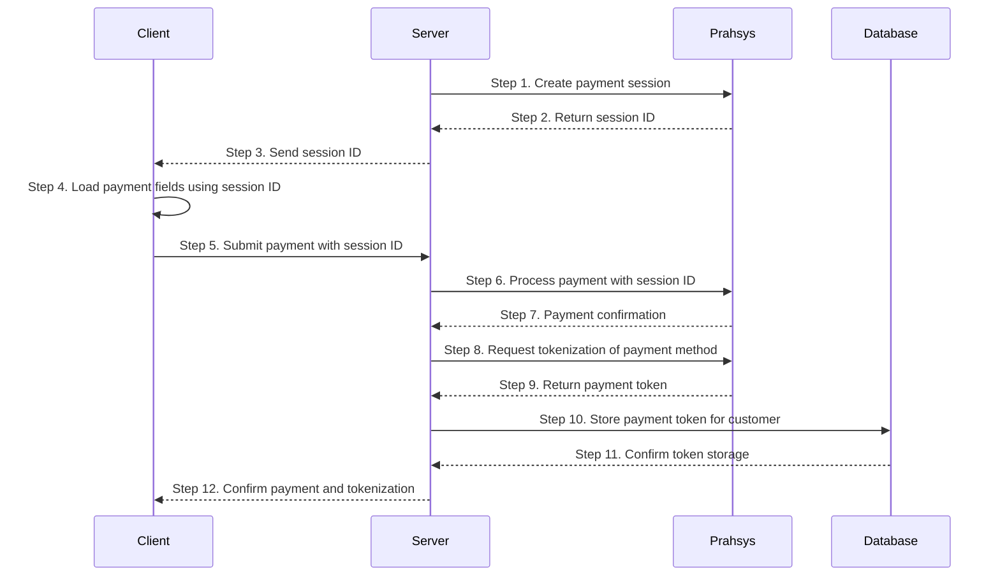

TODO: RECEIPE

## How Tokenization Works

1. A customer provides their payment information (through Pay Portal, Pay Session, or Pay API)
2. Prahsys Payments securely captures the payment details
3. The information is tokenized and stored in our secure vault
4. A token is returned to your system to reference the payment method
5. You use this token for future transactions, without handling sensitive payment data



## Token Management Operations

The Tokenization API provides several endpoints for creating, retrieving, updating, and deleting tokens.

### Creating a Token

There are multiple ways to create a token, depending on your integration method:

#### Session-Based Tokenization

When using Pay Portal or Pay Session, you can generate tokens from session data:

```javascript filename="Server-side JavaScript - Using a session"
const response = await fetch("https://api.prahsys.com/payments/n1/merchant/{merchantId}/token", {
  method: "POST",
  headers: {
    Authorization: `Bearer ${apiKey}`,
    "Content-Type": "application/json",
  },
  body: JSON.stringify({
    session: {
      id: "SESSION0002742481646J67219140J7",
    },
  }),
});
```

> The session must have processed a transaction to tokenize the payment information.

#### Pay API Tokenization (Higher PCI Scope)

When using Pay API, you can tokenize card details directly (requires higher [PCI Compliance](doc:pci-compliants))
Read more about [Pay API](doc:direct-pay)

```javascript filename="Server-side JavaScript - Using card details"
const response = await fetch("https://api.prahsys.com/payments/n1/merchant/{merchantId}/token", {
  method: "POST",
  headers: {
    Authorization: `Bearer ${apiKey}`,
    "Content-Type": "application/json",
  },
  body: JSON.stringify({
    billing: {
      card: {
        number: "4111111111111111",
        expiry: {
          month: "12",
          year: "25",
        },
        securityCode: "123",
      },
    },
  }),
});
```

### Retrieving a Token

You can retrieve details about a token:

```javascript filename="Server-side JavaScript"
const response = await fetch(`https://api.prahsys.com/payments/n1/merchant/{merchantId}/token/${tokenId}`, {
  method: "GET",
  headers: {
    Authorization: `Bearer ${apiKey}`,
  },
});
```

### Updating a Token

You can update certain token attributes:

```javascript filename="Server-side JavaScript"
const response = await fetch(`https://api.prahsys.com/payments/n1/merchant/{merchantId}/token/${tokenId}`, {
  method: "PUT",
  headers: {
    Authorization: `Bearer ${apiKey}`,
    "Content-Type": "application/json",
  },
  body: JSON.stringify({
    // Update card expiry date
    billing: {
      card: {
        expiry: {
          month: "12",
          year: "26",
        },
      },
    },
  }),
});
```

### Deleting a Token

You can delete a token when it's no longer needed:

```javascript filename="Server-side JavaScript"
const response = await fetch(`https://api.prahsys.com/payments/n1/merchant/{merchantId}/token/${tokenId}`, {
  method: "DELETE",
  headers: {
    Authorization: `Bearer ${apiKey}`,
  },
});
```
